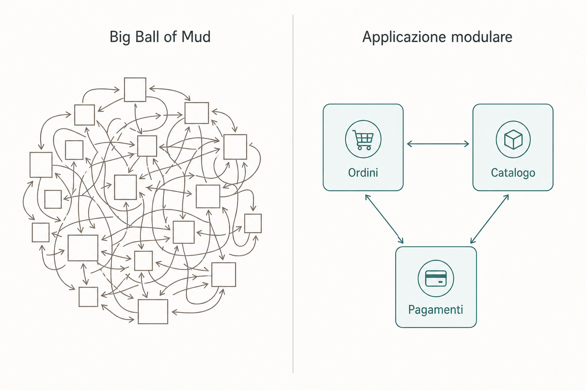

# Escaping the Mud

Confronto tra approccio **framework/database-centric** e **Domain-Driven Design**: due filosofie per progettare software destinato a evolvere.

[Inizia la presentazione →](slides/01-titolo.md)
