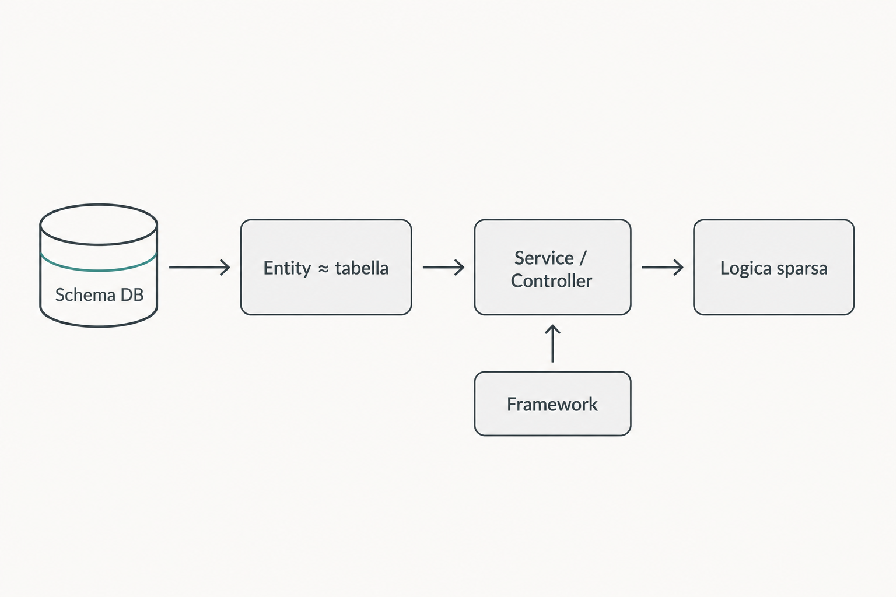

# Il problema

Quando il design parte dal framework o dallo schema del database, il sistema riflette la tecnologia invece del business: nasce un modello anemico e un accoppiamento tecnico difficile da gestire.

- Le entità rispecchiano le tabelle, non i concetti di business
- La logica di dominio si sparge tra controller, service e utility
- Il modello diventa **anemico**: dati senza comportamento
- Il dominio dipende dall’infrastruttura → **accoppiamento tecnico** elevato

Risultato: complessità accidentale che cresce a ogni feature.

---

[← Indietro](01-titolo.md) · [Avanti →](03-approccio-framework-centric.md)
