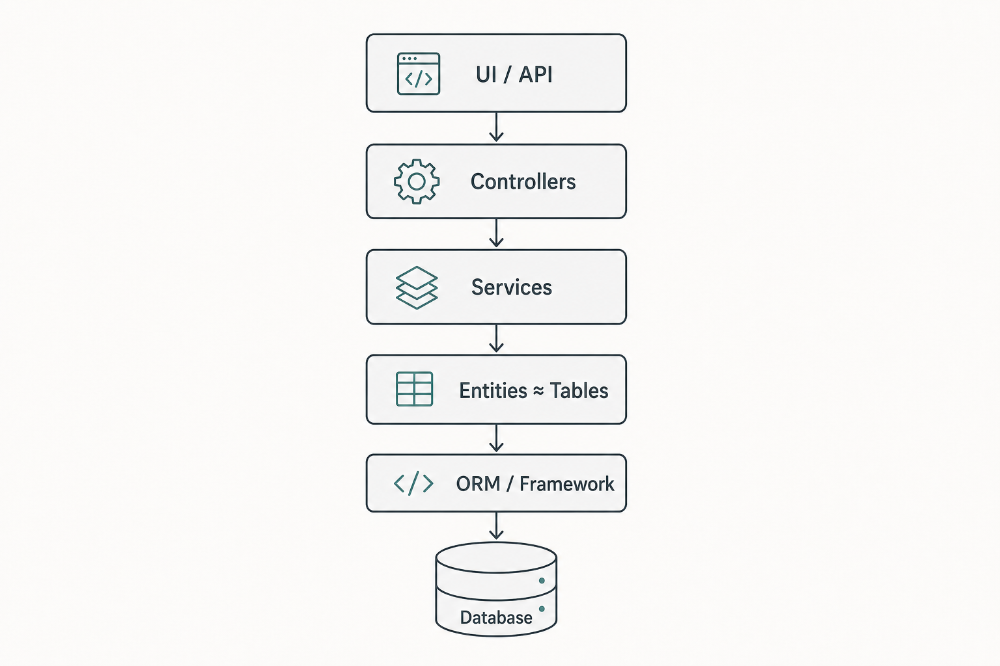

# Approccio Framework / Database-Centric

Approccio in cui framework e database guidano la struttura del codice: produttivo all’inizio, ma fragile quando la complessità di business cresce.

## Caratteristiche

- Entità allineate alle tabelle del database
- Logica di business in controller e service
- Il dominio dipende da framework e infrastruttura

## Pro

- Avvio rapido
- Stack familiare
- Alta produttività nel breve termine

## Contro

- Fragile su progetti complessi
- Difficile da testare in isolamento
- Accoppiamento alto verso tecnologia e schema

---

[← Indietro](02-il-problema.md) · [Avanti →](04-approccio-ddd.md)
