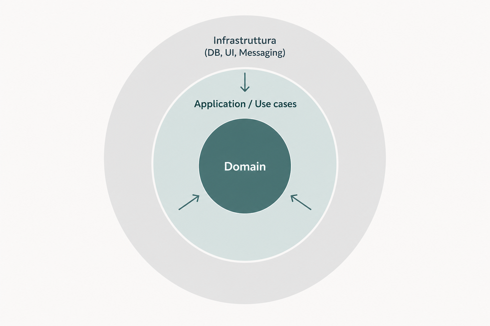

# Approccio Domain-Driven Design

Approccio in cui il dominio di business è il nucleo del sistema: indipendente dall’infrastruttura, espresso in un linguaggio condiviso e organizzato in confini chiari.

## Caratteristiche

- Il **dominio** è al centro, indipendente da framework e database
- Architettura a cipolla / esagonale: le dipendenze puntano verso l’interno
- **Ubiquitous language** condiviso con il business
- **Bounded context** con confini espliciti

## Pro

- Scalabilità organizzativa
- Testabilità del dominio
- Allineamento continuo col business

## Contro

- Maggiore investimento iniziale
- Curva di apprendimento più alta

---

[← Indietro](03-approccio-framework-centric.md) · [Avanti →](05-confronto-visivo.md)
