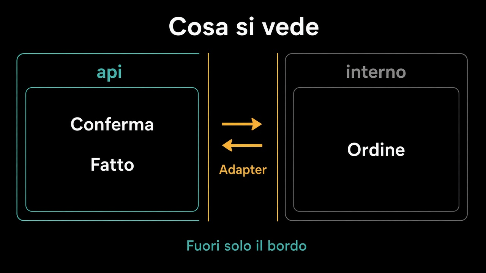

# 2. Cosa vede un modulo

*Fuori, solo il bordo*

← [Dal contesto al modulo](1.dal-contesto-al-modulo.md) · [Indice](README.md) · [Chi chiama chi →](3.chi-chiama-chi.md)

---

## Due elenchi

**Pubblico:** comandi, fatti, id, i port che il modulo *offre*. `ConfermaOrdine`. `OrdineConfermato`. `IdOrdine`. Quello che un altro contesto può nominare senza imparare la lingua interna.

**Interno:** `Ordine`, `RigaOrdine`, `Denaro` se è di Vendite, il mapping, l'outbox come tabella. Chi importa `RigaOrdine` da fuori ha aperto la [porta di servizio](../3.DDD-tattico/4.aggregate.md) che il percorso 3 aveva chiuso.

```text
vendite/
  api/          // ConfermaOrdine, OrdineConfermato, IdOrdine
  interno/      // Ordine, RigaOrdine, adapter
```

I nomi delle cartelle sono un esempio. Il punto è la **visibilità**. Se `interno` si importa da Magazzino, il modulo è una convenzione.



## Niente scorciatoie

Un `public` di troppo è un confine che mente. Un DTO «di comodo» che è l'aggregate con i getter è lo stesso fango, con un suffisso. Si esce con un fatto o con una risposta povera — [come al bordo](../8.Eventi/2.dominio-e-integrazione.md) — non con l'oggetto che protegge la regola.

## Cosa resta fuori

Chi può dipendere da chi: capitolo 3. Come si fa a far rispettare la visibilità: capitolo 4.

E non è il capitolo sul monorepo. Un modulo può stare in un jar, in un package, in una cartella. Se il vicino lo vede tutto, la forma non conta.

Il bordo adesso c'è. Le frecce, no: ancora si può girare in tondo.

---

← [1. Dal contesto al modulo](1.dal-contesto-al-modulo.md) · [Indice](README.md) · **Avanti:** [3. Chi chiama chi →](3.chi-chiama-chi.md)
