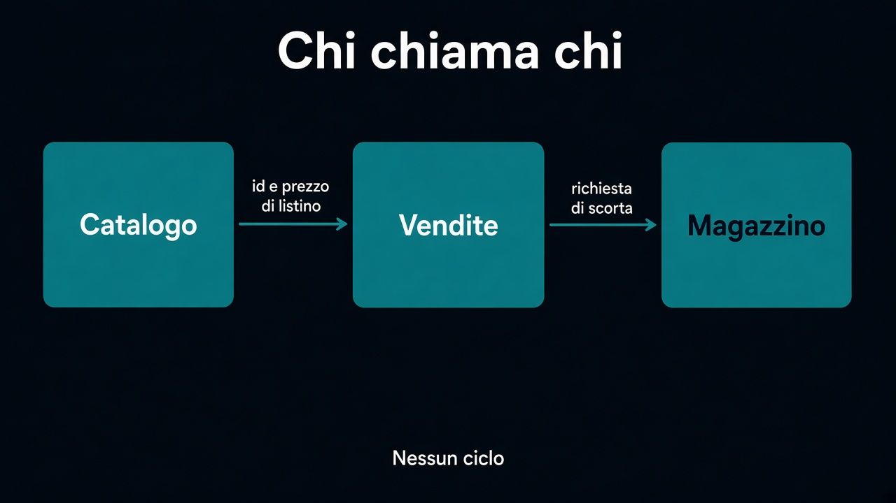

# 3. Chi chiama chi

*La mappa diventa un grafo*

← [Cosa vede un modulo](2.cosa-vede-un-modulo.md) · [Indice](README.md) · [Il confine che si fa rispettare →](4.confine-che-si-rispetta.md)

---

## Le frecce erano già lì

La [context map](../2.DDD-strategico/4.context-map.md) diceva: Catalogo → Vendite → Magazzino. Non era HTTP. Era: questo modello ha bisogno di qualcosa dell'altro. Nel codice quella freccia è una **dipendenza**. Vendite vede l'API di Catalogo. Catalogo non vede Vendite.

```text
catalogo  →  vendite  →  magazzino
                 ↓
             pagamento
```

Un ciclo è un confine invisibile. Se Vendite importa Magazzino e Magazzino importa Vendite, «prodotto» torna a significare due cose nello stesso posto — il fango del [percorso 2](../2.DDD-strategico/3.seguire-una-parola.md), con i moduli in etichetta.



## Come si evita il ciclo

Si traduce. Vendite non importa `Pallet`: pubblica `OrdineConfermato`. Magazzino ascolta, nella sua lingua. Il fatto va a valle; il modello no. Se due moduli devono parlarsi in entrambi i versi, uno dei due sta chiedendo un terzo — o il confine era sbagliato.

Le dipendenze permesse sono poche, scritte, e nello stesso verso della mappa. Tutto il resto è un import di troppo.

## Cosa resta fuori

Come si fa a far sì che l'import di troppo non compili, o non passi la CI: capitolo 4. Dove stanno le tabelle: capitolo 5.

E non è il capitolo sul service mesh. Un ciclo in-process fa lo stesso danno di uno in rete, solo prima.

Il grafo adesso è chiaro. Resta da togliergli la fiducia.

---

← [2. Cosa vede un modulo](2.cosa-vede-un-modulo.md) · [Indice](README.md) · **Avanti:** [4. Il confine che si fa rispettare →](4.confine-che-si-rispetta.md)
