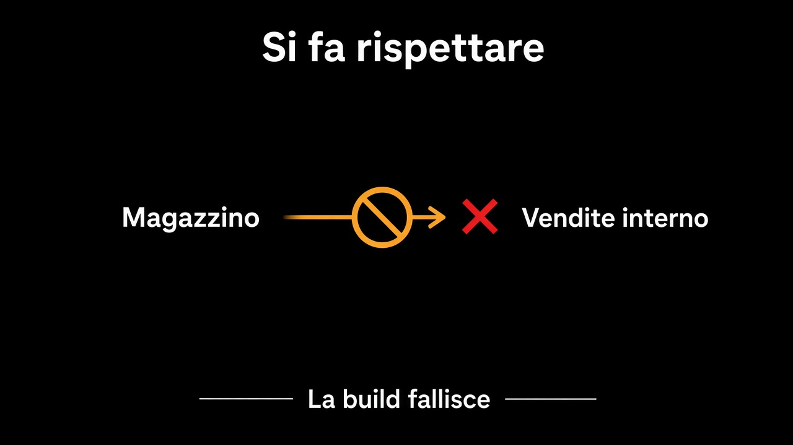

# 4. Il confine che si fa rispettare

*Un accordo verbale è fango in ritardo*

← [Chi chiama chi](3.chi-chiama-chi.md) · [Indice](README.md) · [Un database o tanti schemi →](5.un-database-o-tanti-schemi.md)

---

## Se non fallisce, non c'è

«Non importare `interno` da un altro modulo» scritto in una wiki dura fino al primo venerdì. Il confine vero è quello che **rompe la build**. Un test di architettura, una regola del compilatore, un modulo del linguaggio: uno dei tre. Meglio quello che già avete.

```text
// deve fallire
vendite.interno.Ordine  importato da  magazzino
magazzino               dipende da    vendite.interno
vendite                 dipende da    magazzino      // ciclo
```

È lo stesso gesto del [test di dominio](../9.Test/1.dominio-senza-niente.md): una frase, un rifiuto. La frase qui è sul grafo, non sull'ordine. «Vendite non vede Pallet» è falsificabile.



## Cosa misurano

La visibilità del capitolo 2. La direzione del capitolo 3. Non misurano se `conferma()` è giusta — quello resta il test di dominio. Misurano se il bordo c'è ancora lunedì.

Se il test di architettura è pieno di eccezioni, il grafo è già mentito e state documentando il fango. Si stringe la regola, o si ammette che quei due moduli sono uno.

## Cosa resta fuori

Lo schema: capitolo 5. Un test di architettura verde con una join tra `ordini` e `pallet` è un confine che mente dal basso.

E non è il capitolo su un vendor. ArchUnit, moduli del linguaggio, package privati: scelgo quello che fallisce in CI. Il resto è gusto.

Il codice adesso non si importa di nascosto. I dati, sì — se stanno nello stesso schema.

---

← [3. Chi chiama chi](3.chi-chiama-chi.md) · [Indice](README.md) · **Avanti:** [5. Un database o tanti schemi →](5.un-database-o-tanti-schemi.md)
