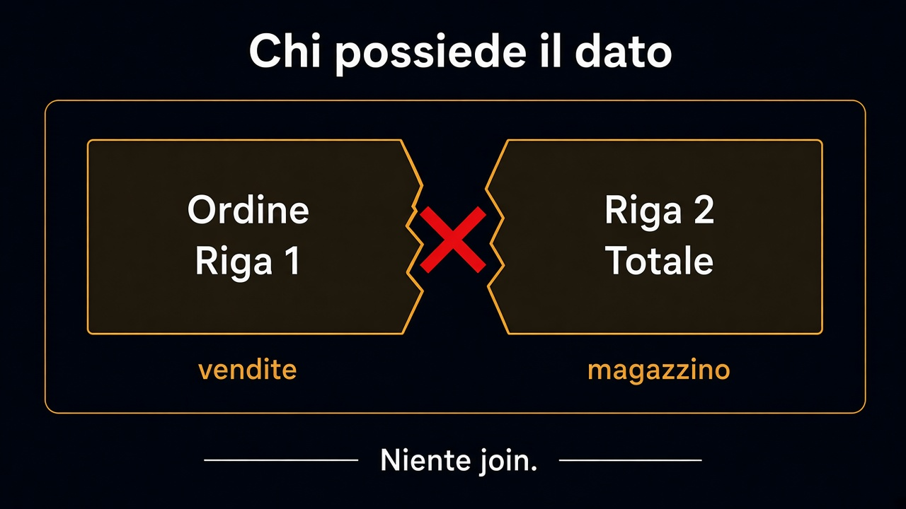

# 5. Un database o tanti schemi

*Chi possiede il dato*

← [Il confine che si fa rispettare](4.confine-che-si-rispetta.md) · [Indice](README.md) · [Quando estrarre un servizio →](6.quando-estrarre.md)

---

## Lo schema è un bordo

Il [percorso 7](../7.Persistenza/1.aggregate-non-e-tabella.md) ha detto che l'aggregate non è una tabella. Qui si aggiunge: **le tabelle di un modulo non si leggono da un altro**. Una join `ordini` × `pallet` è Magazzino dentro Vendite, fatta in SQL. Il test di architettura non la vede.

Un database, tanti **schemi** — o tanti prefissi, o tanti cataloghi. Lo strumento conta poco. Conta che Vendite non possa nominare `magazzino.pallet` e che Magazzino non possa aggiornare `vendite.ordini`.

```text
vendite.ordini
vendite.righe_ordine
magazzino.ubicazioni
-- niente JOIN tra i due
```



## Come si legge l'altro

Non si legge. Si ascolta un fatto, o si chiede a un port. «È pubblicabile?» è `Catalogo.ePubblicabile(id)`, non una select sulla scheda. Il read model di una schermata può copiare colonne — è una cache, ha un padrone, e si aggiorna da un fatto, non da una join notturna «perché è più facile».

Se due moduli devono condividere la riga, uno dei due non è un modulo: è una libreria, o il confine era sbagliato.

## Cosa resta fuori

Quando quel modulo merita un processo suo: capitolo 6.

E non è il capitolo su un database per microservizio. Un solo motore con due schemi tiene il bordo. Due motori senza bordo tengono solo l'ops occupata.

Il dato adesso ha un padrone. Estrarre un servizio, da qui, è una scelta — non una fuga.

---

← [4. Il confine che si fa rispettare](4.confine-che-si-rispetta.md) · [Indice](README.md) · **Avanti:** [6. Quando estrarre un servizio →](6.quando-estrarre.md)
