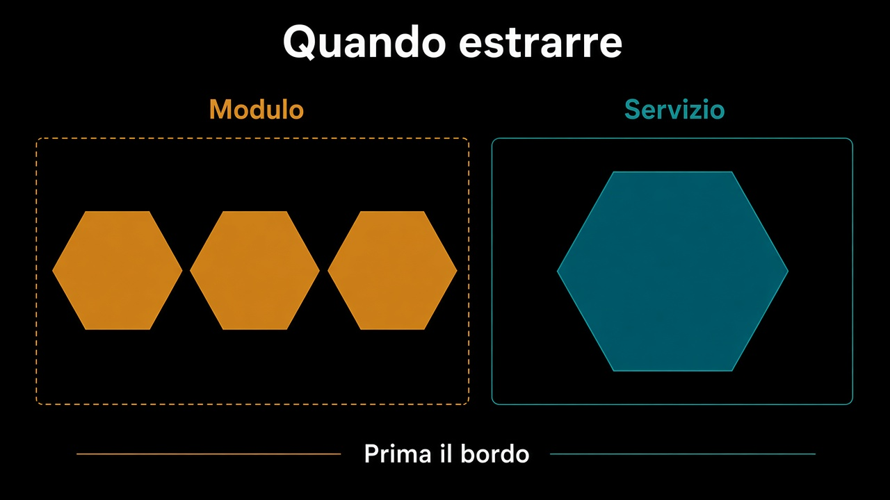

# 6. Quando estrarre un servizio

*Il modulo è il prerequisito*

← [Un database o tanti schemi](5.un-database-o-tanti-schemi.md) · [Indice](README.md)

---

## Prima il bordo, poi la rete

Se il modulo non esiste, il servizio è un [monolite spezzato](../2.DDD-strategico/2.sottodominio-e-bounded-context.md): stesso linguaggio da entrambe le parti, più la latenza. Estrarre significa prendere un modulo che già ha API, fatti, schema, test di architettura — e dargli un processo. Non significa tagliare un package a metà.

## Segnali veri

| Segnale | Perché conta |
|---|---|
| Ritmo di rilascio diverso | Vendite ogni giorno, magazzino ogni mese |
| Scala diversa | le letture del catalogo non sono gli scritti dell'ordine |
| Team e orari che non si toccano | il confine organizzativo c'è già |
| Un fallimento che non deve fermare l'altro | il PSP giù non deve fermare la bozza |

Non è un segnale: «così è più DDD». Non è un segnale: «così ogni tabella ha il suo repo». Non è un segnale: l'organigramma di sei mesi fa.

Se nessuno di quei quattro è vero, il modulo nello stesso processo è il posto giusto. Costa meno, e i fatti del [percorso 8](../8.Eventi/README.md) restano fatti — solo senza la rete in mezzo.

## Cosa succede ora

Il viaggio della storia principale è chiuso: confini, regole, core, stato, fatti, conto dei test, moduli che li tengono. A lato restano gli [appunti sulla complessità](../5.PhilosophyofSoftwareDesign/README.md) e, in fondo, [Agentic AI](../99.Agentic-Ai/README.md).

---

## Percorso completo

1. [Dal contesto al modulo](1.dal-contesto-al-modulo.md)
2. [Cosa vede un modulo](2.cosa-vede-un-modulo.md)
3. [Chi chiama chi](3.chi-chiama-chi.md)
4. [Il confine che si fa rispettare](4.confine-che-si-rispetta.md)
5. [Un database o tanti schemi](5.un-database-o-tanti-schemi.md)
6. **Quando estrarre un servizio** (sei qui)

← [Torna all'indice](README.md) · [Mappa dei percorsi](../README.md)
