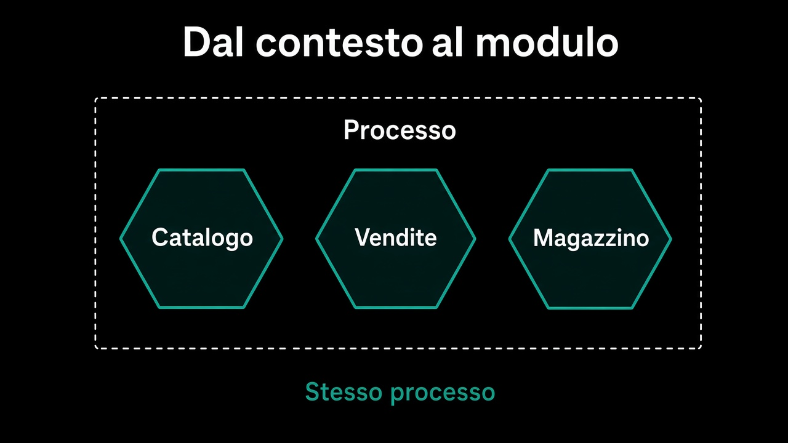

# Moduli — dal confine al codice che lo rispetta

Un bounded context diventa un modulo, non un servizio.

Il [percorso 2](../2.DDD-strategico/2.sottodominio-e-bounded-context.md) ha chiuso i linguaggi e ha lasciato fuori moduli e dipendenze: arrivano qui. Il deploy resta un'altra decisione. Qui contano visibilità, e un confine che non è un accordo verbale.

## Percorso

Leggi i capitoli in ordine. Ogni pagina è collegata alla precedente e alla successiva.

| # | Capitolo | Cosa imparerai |
|---|---|---|
| 1 | [Dal contesto al modulo](1.dal-contesto-al-modulo.md) | Cosa cambia e cosa no, quando il confine diventa codice |
| 2 | [Cosa vede un modulo](2.cosa-vede-un-modulo.md) | API pubblica contro l'interno |
| 3 | [Chi chiama chi](3.chi-chiama-chi.md) | La context map diventa un grafo |
| 4 | [Il confine che si fa rispettare](4.confine-che-si-rispetta.md) | Test di architettura, non accordi |
| 5 | [Un database o tanti schemi](5.un-database-o-tanti-schemi.md) | Chi possiede il dato, nessuna join tra moduli |
| 6 | [Quando estrarre un servizio](6.quando-estrarre.md) | Segnali veri, e il modulo come prerequisito |

## L'idea in una frase

Il confine del **modello** diventa un modulo con un dentro e un fuori. Il processo può restare uno. Le dipendenze no: hanno una direzione, e un test che la fa rispettare.

---

**Inizia da qui →** [1. Dal contesto al modulo](1.dal-contesto-al-modulo.md)
