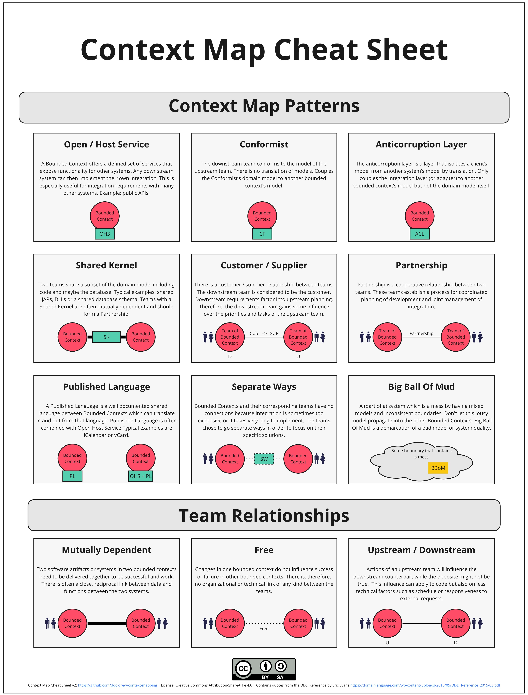

# 2. Leggere la context map

*Chi dipende da chi — e con quale contratto di potere*

← [Bounded Context Canvas](1.bounded-context-canvas.md) · [Indice](README.md) · [Rapporti di team →](3.rapporti-di-team.md)

---

## Cosa aggiunge rispetto al percorso 2

Nel [capitolo sulla context map](../2.DDD-strategico/4.context-map.md) bastava una mappa piccola: Catalogo → Vendite → Magazzino, e la regola *chi possiede il vocabolario, chi si adatta*. La tabella dei rapporti restava fuori.

Qui quella tabella diventa strumento. Non per disegnare l'azienda intera: per nominare **un** contatto alla volta.

## Freccia ≠ HTTP

Una freccia dice: *questo modello ha bisogno di qualcosa dell'altro*. Può essere una libreria condivisa, un evento, una chiamata, un file notturno. Il mezzo è dettaglio; il **tipo di rapporto** è design.

Sulla cheat sheet ci sono due strati:

1. **Rapporti di team** — mutual, upstream/downstream, free: chi influenza il successo di chi
2. **Pattern** — come si propaga (o si isola) il modello: OHS, conformist, ACL, shared kernel…

Il canvas mette il relationship type sul bordo di *un* contesto. La mappa lo mette fra *due* scatoloni.

## Come usarla

Preferisci mappe piccole, una domanda per volta: «chi obbliga Vendite a tradurre?», «il Catalogo espone un contratto pubblico o ogni cliente si adatta?». Non serve mettere tutti i pattern sulla stessa figura.

## Cosa resta fuori

Team Topologies, organigrammi, Miro templates. I prossimi capitoli spiegano **ogni** pezzo della cheat sheet, con l'icona ufficiale e un aggancio a Catalogo / Vendite / Magazzino.

Si parte dai tre rapporti di team: senza quelli, i pattern restano etichette decorative.

---

← [1. Bounded Context Canvas](1.bounded-context-canvas.md) · [Indice](README.md) · **Avanti:** [3. Rapporti di team →](3.rapporti-di-team.md)
