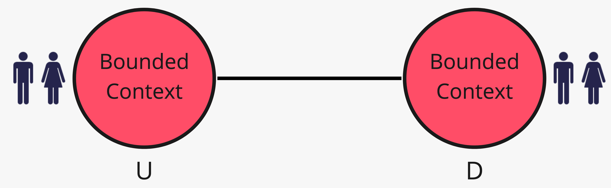
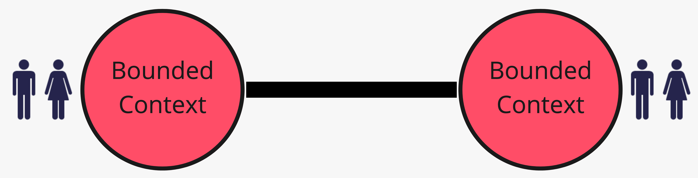
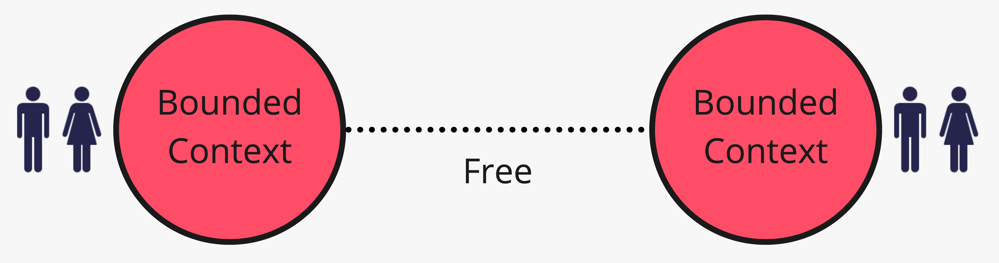

# 3. Rapporti di team

*Chi influenza il successo di chi*

← [Leggere la context map](2.leggere-la-context-map.md) · [Indice](README.md) · [Servizio, lingua, cliente →](4.servizio-lingua-cliente.md)

---

Prima dei nove pattern: tre modi in cui due contesti (e i team che li curano) stanno insieme. Il potere sul linguaggio nasce da qui.

## Upstream / Downstream

L'upstream può riuscire anche se il downstream fallisce. Se Catalogo rinomina gli id o cambia cosa sia un «prezzo», Vendite deve accorgersene. Vendite è upstream di Magazzino quando chiede una scorta: Magazzino esegue nel *suo* linguaggio, non decide lo sconto.

La freccia del percorso 2 era già questa idea, senza nome.

## Mutually dependent

I due artefatti devono andare in produzione insieme. Dati e capacità sono intrecciati; serve molta comunicazione. Spesso va a braccetto con **Partnership** (capitolo 6): non è solo una freccia tecnica, è un impegno di rilascio condiviso.

Nel nostro esempio piccolo è raro. Compare quando «ordine» e «fattura» non possono vivere una settimana fuori sincronia e i team non possono decidere da soli.

## Free

Cambiamenti altrove non decidono il destino di questo contesto. Autenticazione generica rispetto a Vendite, o un tool interno che nessuno chiama: **Separate Ways** (capitolo 7) è il pattern tipico quando la libertà è una scelta consapevole, non un isolamento accidentale.

## Cosa resta fuori

Customer/Supplier è un *modo di governare* un upstream/downstream: sta nel prossimo capitolo, vicino a Open-Host e Published Language.

Con i tre rapporti in mano, si può scegliere *come* si espone e si consuma il modello.

---

← [2. Leggere la context map](2.leggere-la-context-map.md) · [Indice](README.md) · **Avanti:** [4. Servizio, lingua, cliente →](4.servizio-lingua-cliente.md)
