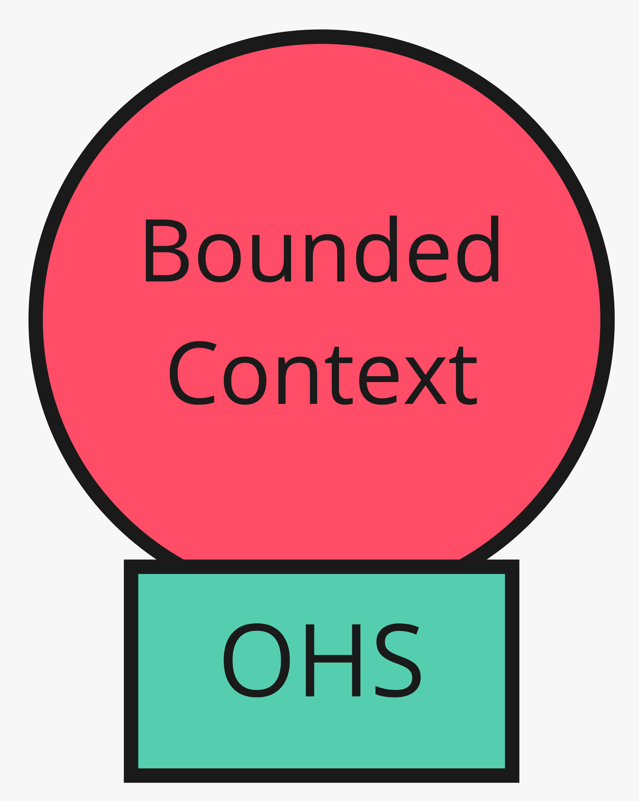
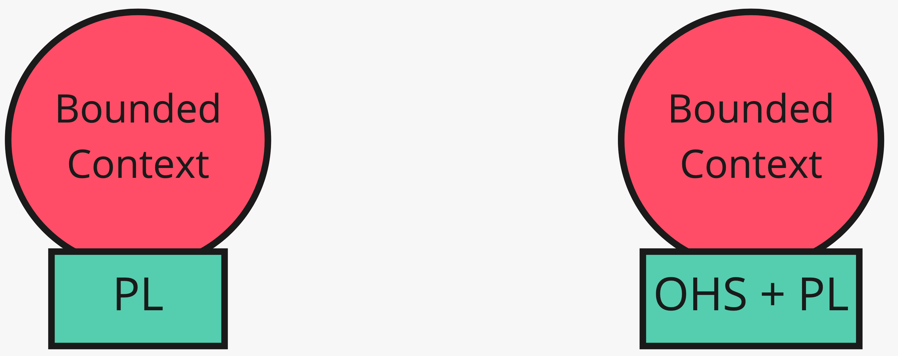
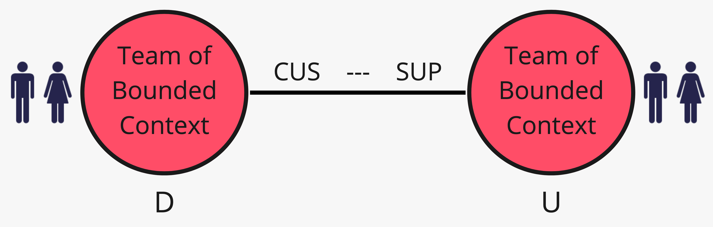

# 4. Servizio, lingua, cliente

*Come l'upstream espone, e come si negozia*

← [Rapporti di team](3.rapporti-di-team.md) · [Indice](README.md) · [Conformarsi o tradurre →](5.conformarsi-o-tradurre.md)

---

Tre pattern che spesso stanno insieme sull'upstream: un protocollo aperto, una lingua condivisa per i messaggi, e un accordo in cui il downstream conta nella pianificazione.

## Open-Host Service

L'upstream espone un protocollo che **tutti** i client possono usare. Si evolve per esigenze comuni; se un solo team ha bisogni strani, si aggiunge un traduttore one-off — non si sporca il contratto condiviso.

Catalogo come OHS: «dammi listino per id» è un contratto stabile. Vendite e altri downstream lo usano senza importare la scheda prodotto intera.

## Published Language

La traduzione fra modelli usa un linguaggio **pubblico e documentato** — non il modello interno di nessuno. Esempi noti fuori dal nostro dominio: iCalendar, vCard. Spesso va in coppia con OHS.

Fra Vendite e Magazzino: un evento `OrdineConfermato` povero (id ordine, SKU, quantità) è published language. Non è l'aggregate `Ordine` serializzato.

## Customer / Supplier

È un upstream/downstream **governato**: le priorità del customer (downstream) entrano nel budget e nello schedule del supplier (upstream). Non è altruismo occasionale: è un impegno esplicito.

Se Vendite dipende da un cambio di listino per una campagna, e Catalogo lo tratta come pezzo di roadmap negoziata, è Customer/Supplier. Se Catalogo pubblica e Vendite si arrangia, è solo U/D — magari con Conformist o ACL.

## Cosa resta fuori

Come si implementa il protocollo (HTTP, coda, file). Conta il contratto e chi lo governa.

A valle restano due scelte sul *modello*: aderire slavishly, o tradurre. Prossimo capitolo.

---

← [3. Rapporti di team](3.rapporti-di-team.md) · [Indice](README.md) · **Avanti:** [5. Conformarsi o tradurre →](5.conformarsi-o-tradurre.md)
