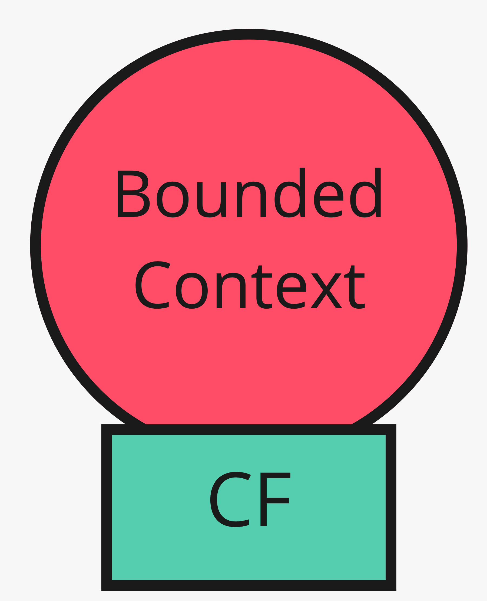
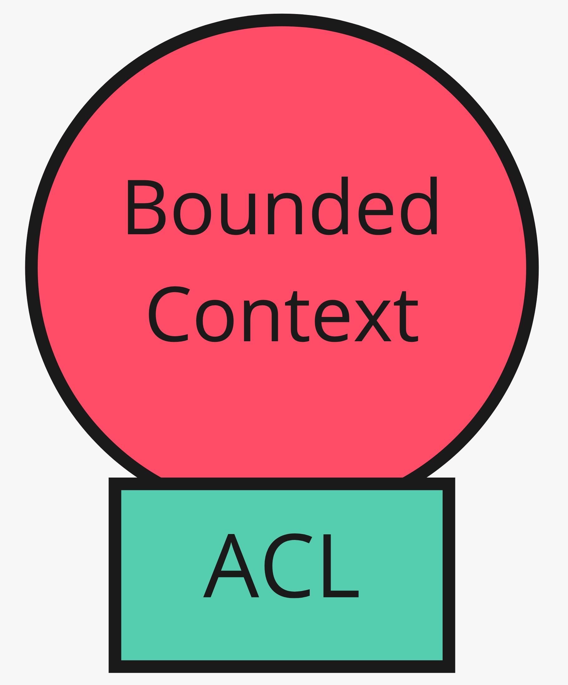

# 5. Conformarsi o tradurre

*A valle: adottare il modello altrui, o isolarlo*

← [Servizio, lingua, cliente](4.servizio-lingua-cliente.md) · [Indice](README.md) · [Kernel e partnership →](6.kernel-e-partnership.md)

---

Stesso upstream, due strategie downstream. Entrambe valide: cambiano il costo e chi paga la complessità.

## Conformist

Si elimina la traduzione aderendo al modello a monte. Si condivide il linguaggio; l'upstream resta al posto di guida. Integrazione più semplice, modello locale meno ideale.

Ha senso su pezzi di supporto o generici: se Vendite consuma un servizio fiscale esterno e quel vocabolario non è il core, conformarsi può costare meno di un ACL.

## Anticorruption Layer

A valle si costruisce uno strato che parla all'altro sistema con la sua interfaccia, e **dentro** espone solo il proprio modello. Poca o nessuna modifica all'upstream.

È il gesto del [tradurre al bordo](../2.DDD-strategico/5.tradurre-al-bordo.md): da `ProdottoCatalogo` a `IdProdotto` e `PrezzoListino` sulla riga. ERP, corriere, PSP: il loro JSON non diventa dominio.

Nel canvas, sull'inbound/outbound di Vendite verso Catalogo, ACL è spesso il relationship type giusto sul lato Vendite — anche se Catalogo è OHS.

## Come scegliere

| | Conformist | ACL |
|---|---|---|
| Costo | Basso all'inizio | Più codice al bordo |
| Rischio | Il modello altrui entra nel core | Traduzione da mantenere |
| Quando | Upstream stabile, pezzo non core | Core da proteggere, upstream volatile o legacy |

## Cosa resta fuori

Dove vive l'ACL nel codice (adapter): [percorso esagonale](../4.Hexagonal-architecture/README.md). Qui conta la scelta strategica.

A volte non si traduce né si conforma: si **condivide** un pezzo di modello, o si coordina il rilascio. Prossimo capitolo.

---

← [4. Servizio, lingua, cliente](4.servizio-lingua-cliente.md) · [Indice](README.md) · **Avanti:** [6. Kernel e partnership →](6.kernel-e-partnership.md)
