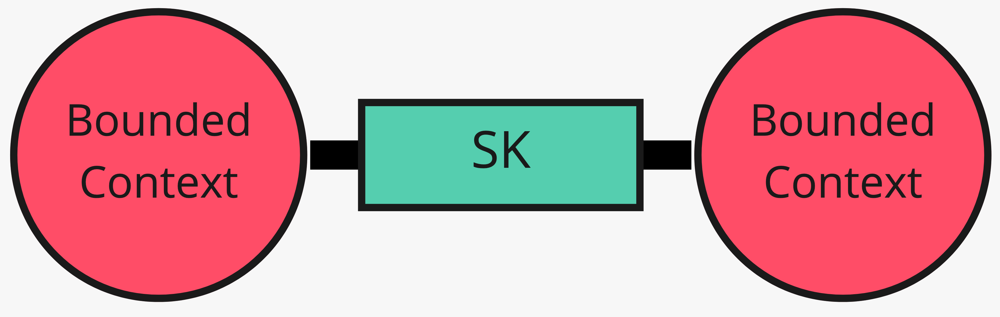
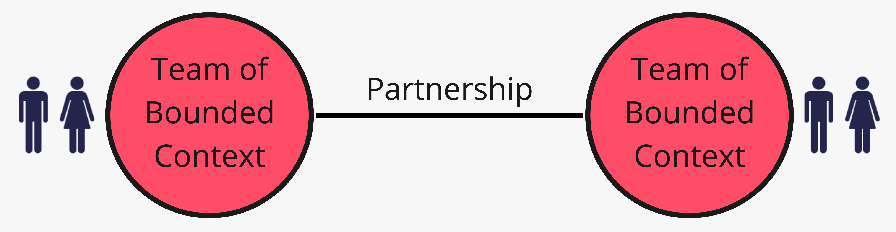

# 6. Kernel e partnership

*Condividere un pezzo, o condividere il destino del rilascio*

← [Conformarsi o tradurre](5.conformarsi-o-tradurre.md) · [Indice](README.md) · [Separarsi o demarcare →](7.separarsi-o-demarcare.md)

---

Due pattern vicini al mutual dependence: uno sul **modello**, uno sul **processo** di squadra.

## Shared Kernel

Si delimita un pezzo piccolo di dominio che i team accettano di condividere — tipi, regole, magari schema. Dentro quel confine, niente cambio senza consultare l'altro.

Il kernel deve restare **piccolo**. Se Catalogo e Vendite condividono l'intera entità prodotto, non è un kernel: è un confine sparito. Un `IdProdotto` versionato e una regola di formato SKU possono esserlo.

Ogni allargamento del kernel è debito di coordinamento.

## Partnership

Se il fallimento di uno fa fallire la delivery dell'altro, si istituisce partnership: planning congiunto, integrazione gestita insieme, feature interdipendenti sullo stesso rilascio.

Non è «siamo amici». È processo: chi decide le interfacce, quando si integra, cosa blocca il go-live.

Su Vendite e Pagamento in una campagna «paga alla conferma», partnership (o almeno Customer/Supplier stretto) evita che un team rilasci un flusso che l'altro non può ancora chiudere.

## Cosa resta fuori

Come spezzare un kernel troppo grosso (spesso: pubblicare un linguaggio e tornare a U/D + ACL). Il [monolite modulare](../10.Moduli/README.md) parla di dipendenze nel codice; qui conta l'accordo fra modelli e team.

Ultimo pezzo della cheat sheet: quando **non** c'è rapporto — o quando il rapporto è col fango.

---

← [5. Conformarsi o tradurre](5.conformarsi-o-tradurre.md) · [Indice](README.md) · **Avanti:** [7. Separarsi o demarcare →](7.separarsi-o-demarcare.md)
