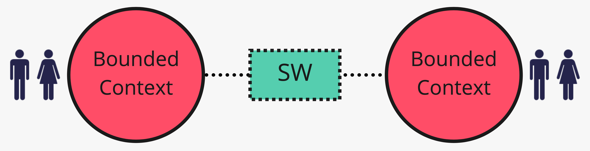
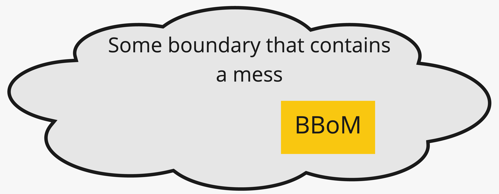

# 7. Separarsi o demarcare

*Nessun legame, o un confine col disordine*

← [Kernel e partnership](6.kernel-e-partnership.md) · [Indice](README.md) · [NestJS + CQRS →](8.nestjs-cqrs.md)

---

## Separate Ways

Si dichiara che due contesti non si integrano. Ognuno trova soluzioni semplici nel proprio perimetro. È il pattern del rapporto **Free** quando la libertà è scelta: duplicare una piccola regola può costare meno di un'integrazione permanente.

Esempio: un tool interno di reportistica HR e Vendite — niente freccia, niente eventi. Se un giorno serve un dato, si valuta un rapporto esplicito; finché non serve, Separate Ways.

## Big Ball of Mud

Non è un obiettivo di design: è la **demarcazione** di un pezzo (o di un sistema) con modelli misti e confini inconsistenti. Sulla mappa serve a dire: *qui c'è fango — non lasciarlo entrare negli altri contesti*.

La risposta tipica a valle di un BBOM è un ACL aggressivo, o strangler e cuciture (altro discorso, fuori da questo percorso). Metterlo in mappa evita di trattare il legacy come se fosse un OHS pulito.

## Sintesi sulla mappa Vendite

| Contatto | Rapporto / pattern |
|---|---|
| Catalogo → Vendite | U/D; Catalogo spesso OHS (+ published language); Vendite con **ACL** |
| Vendite → Magazzino | U/D; messaggio in published language; Magazzino non importa `Ordine` |
| Vendite ↔ Pagamento | U/D o partnership; Customer/Supplier se si pianifica insieme |
| Tool generici | Free / Separate Ways |

I nomi non sono decorazione: sono scelte su chi possiede il vocabolario e chi paga la traduzione.

## Cosa resta fuori

Come uscire dal fango che esiste già (strangler, cuciture): backlog del repo, non questo capitolo.

I nomi sulla mappa diventano confini di import: il prossimo capitolo li traduce in NestJS + CQRS.

---

← [6. Kernel e partnership](6.kernel-e-partnership.md) · [Indice](README.md) · **Avanti:** [8. NestJS + CQRS →](8.nestjs-cqrs.md)
