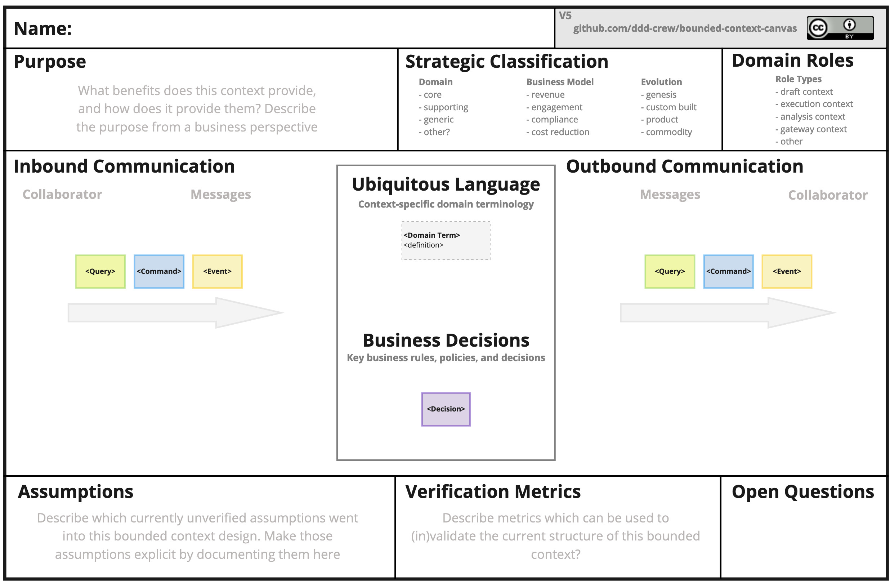

# Canvas e relazioni fra contesti

Documentare un bounded context, e nominare come si tocca con gli altri.

Il [percorso 2](../2.DDD-strategico/README.md) dà l'idea dello strategico: linguaggio, confine, mappa piccola, traduzione. Qui si approfondisce. Non è un passo obbligatorio verso il [percorso 3](../3.DDD-tattico/README.md): è il catalogo che il capitolo sulla context map aveva lasciato fuori.

## Percorso

Leggi i capitoli in ordine. Ogni pagina è collegata alla precedente e alla successiva. Prerequisito: il percorso 2, soprattutto [context map](../2.DDD-strategico/4.context-map.md) e [tradurre al bordo](../2.DDD-strategico/5.tradurre-al-bordo.md).

| # | Capitolo | Cosa imparerai |
|---|---|---|
| 1 | [Bounded Context Canvas](1.bounded-context-canvas.md) | Un foglio per un contesto: dentro e, soprattutto, fuori |
| 2 | [Leggere la context map](2.leggere-la-context-map.md) | La cheat sheet dei rapporti; freccia ≠ HTTP |
| 3 | [Rapporti di team](3.rapporti-di-team.md) | Upstream/downstream, mutual, free |
| 4 | [Servizio, lingua, cliente](4.servizio-lingua-cliente.md) | Open-Host, Published Language, Customer/Supplier |
| 5 | [Conformarsi o tradurre](5.conformarsi-o-tradurre.md) | Conformist e Anticorruption Layer |
| 6 | [Kernel e partnership](6.kernel-e-partnership.md) | Shared Kernel e Partnership |
| 7 | [Separarsi o demarcare](7.separarsi-o-demarcare.md) | Separate Ways, Big Ball of Mud, sintesi su Vendite |
| 8 | [Dalla context map a NestJS + CQRS](8.nestjs-cqrs.md) | Ogni pattern come confine di import in un monolite NestJS |

## L'idea in una frase

Un contesto si documenta con ciò che espone e ciò da cui dipende; i rapporti fra contesti hanno **nomi** — e ogni nome è una scelta di potere sul linguaggio.

## Crediti

Canvas e cheat sheet: [ddd-crew / ddd-starter-modelling-process](https://github.com/ddd-crew/ddd-starter-modelling-process) (Bounded Context Canvas di Nick Tune; cheat sheet di Michael Plöd). Icone dei pattern: [ddd-crew / context-mapping](https://github.com/ddd-crew/context-mapping). Materiale sotto [CC BY 4.0](https://creativecommons.org/licenses/by/4.0/).

---

**Inizia da qui →** [1. Bounded Context Canvas](1.bounded-context-canvas.md)
