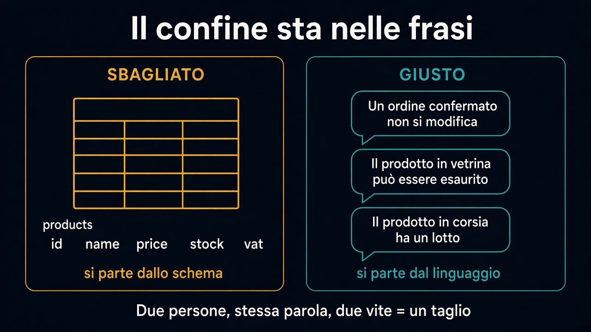

# 1. Parole, esempi, ambiguità

*Il confine si trova parlando, non aprendo il database*

← [Indice](README.md) · [Sottodominio e bounded context →](2.sottodominio-e-bounded-context.md)

---

## Da dove si comincia

Nel [percorso 1](../1.DDD-vs-framework/README.md) il fango nasce quando l'entità copia la tabella. Il rischio speculare è un *unico* modello “di business” grande quanto l'azienda: stesse classi, stesse parole, regole che non stanno insieme.

I confini non si trovano in `products`. Si trovano nelle **frasi** che il business può falsificare.

> Un ordine confermato non si modifica.
> Il prodotto in vetrina può essere esaurito.
> Il prodotto in corsia ha un lotto e una scadenza.

Tre frasi. La parola «prodotto» non significa la stessa cosa. Quello è un taglio, non un dettaglio da unificare dopo.

## Cosa raccogliere

Insieme a chi vende, spedisce, fattura — non al posto loro:

- **parole** che usano senza pensarci
- **esempi** (“l'ordine di martedì, quello con lo sconto sbagliato”)
- **eccezioni** (“tranne i resi”, “tranne il dropshipping”)
- **ambiguità** — due persone, stessa parola, due vite

Dove due esperti litigano sul significato, c'è un confine. Dove tutti danno per scontato lo stesso esempio, c'è un modello.

## Cosa non fare ancora

Non si parte dall'organigramma (“il team magazzino avrà il suo servizio”). Non si parte dallo schema. Non si disegna ancora la mappa.

Prima il metodo: linguaggio + esempi. Poi i nomi dei pezzi.

Il prossimo capitolo distingue due cose che si confondono subito: l'area del *problema* e il *modello* con un dentro e un fuori.

---

← [Indice](README.md) · **Avanti:** [2. Sottodominio e bounded context →](2.sottodominio-e-bounded-context.md)
