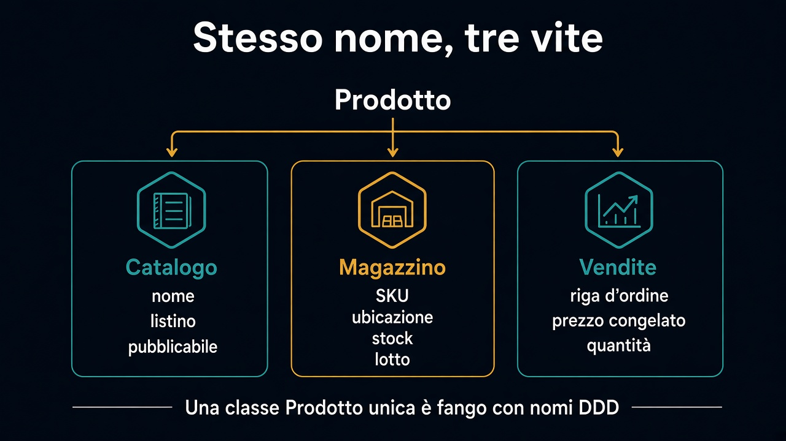

# 3. Seguire una parola

*Stesso nome, due vite*

← [Sottodominio e bounded context](2.sottodominio-e-bounded-context.md) · [Indice](README.md) · [Context map →](4.context-map.md)

---

## Insegui «prodotto»

Prendi una parola e cammina da una stanza all'altra. Non chiedere “cos'è un prodotto”. Chiedi “dimmi l'ultimo che hai toccato”.

### Catalogo

Nome, descrizione, prezzo di **listino**, categoria, pubblicabile sì/no.

Il merchandiser spegne la vetrina. Lo stock in corsia può esserci ancora. Non gli importa.

### Magazzino

SKU, ubicazione, quantità **disponibile**, lotto, scadenza.

Il magazziniere sposta un pallet. Il prezzo di listino *non entra*. «Prodotto» è un pezzo fisico, o un'occupazione di scaffale.

### Vendite

Riga d'ordine, **prezzo congelato** al momento, quantità richiesta.

Chi conferma un ordine non sta guardando lo scaffale. Sta chiudendo un impegno con un cliente. Lo stock è un altro discorso. Il listino di oggi non deve riscrivere l'ordine di ieri.

## La tentazione

Forzare una classe `Prodotto` unica è il [ball of mud](../1.DDD-vs-framework/README.md) con nomi DDD: un record che sa di vetrina, di lotto e di sconto commerciale.

Tre vite. Tre modelli. Al massimo condividono un **identificativo** — e anche quello, a volte, si traduce.

Il prossimo capitolo mette questi tre pezzi su una mappa: chi ha bisogno di cosa, senza fingere che siano indipendenti.

---

← [2. Sottodominio e bounded context](2.sottodominio-e-bounded-context.md) · [Indice](README.md) · **Avanti:** [4. Context map →](4.context-map.md)
