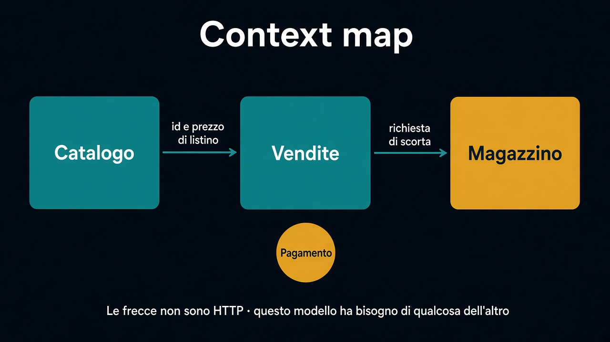

# 4. Context map

*Chi dipende da chi, e di cosa*

← [Seguire una parola](3.seguire-una-parola.md) · [Indice](README.md) · [Tradurre al bordo →](5.tradurre-al-bordo.md)

---

## Una mappa piccola

Non serve l'azienda intera. Basta il sistema di vendita che stiamo usando:

- **Catalogo** — cosa si può mostrare e a che listino
- **Vendite** — ordini, conferma, annullamento
- **Magazzino** — scorte, ubicazioni

Pagamento può stare accanto, come satellite: Vendite chiede “incassa”, non importa il protocollo del PSP. Come si tiene insieme quel «chiede» — un fatto, poi un altro — sta nel [percorso sugli eventi](../8.Eventi/6.coreografia-od-orchestrazione.md).

## Cosa sono le frecce

Una freccia **non** è una chiamata HTTP. È: *questo modello ha bisogno di qualcosa dell'altro*.

Vendite usa un **identificativo** e un prezzo dal catalogo. Non importa la scheda, le foto, la categoria. Magazzino riserva quantità. Non conosce lo sconto commerciale.

Se la freccia porta dietro *tutto* il modello a monte, non è una mappa: è un import.

## Upstream e downstream

Chi cambia il linguaggio obbliga l'altro a **tradurre**.

Il catalogo è a monte di vendite: se rinomina gli id o cambia cosa sia un “prezzo”, vendite deve accorgersene. Vendite è a monte del magazzino quando chiede una scorta: il magazzino non decide lo sconto, esegue una richiesta nel *suo* linguaggio (SKU, quantità).

Non serve la tabella di tutti i rapporti (OHS, conformist, partnership…). Serve *un* rapporto visibile: chi possiede il vocabolario, chi si adatta.

Il prossimo capitolo è il gesto concreto di quella freccia: tradurre al bordo, senza inghiottire l'altro modello.

---

← [3. Seguire una parola](3.seguire-una-parola.md) · [Indice](README.md) · **Avanti:** [5. Tradurre al bordo →](5.tradurre-al-bordo.md)
