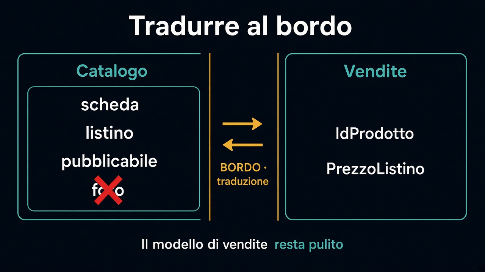

# 5. Tradurre al bordo

*Proteggersi dal vocabolario altrui*

← [Context map](4.context-map.md) · [Indice](README.md) · [Quando il confine si muove →](6.quando-il-confine-si-muove.md)

---

## Usare senza inghiottire

Vendite ha bisogno del catalogo. Non ha bisogno dell'entità catalogo.

Al bordo si **traduce**: da `ProdottoCatalogo` (scheda, listino, flag vetrina) a ciò che vendite sa usare — `IdProdotto` e un `PrezzoListino` da congelare sulla riga.

Dentro Vendite non esiste “pubblicabile”. Dentro il catalogo non esiste “ordine confermato”.

## Lingue esterne

ERP, corriere, PSP: parlano un'altra lingua. Il loro JSON non diventa il dominio.

Se `sku`, `vatCode` e `availableQty` attraversano il controller e finiscono nelle regole di conferma, il confine è già saltato. Traduci *prima* di decidere.

Non è un discorso di framework. È lo stesso gesto del capitolo 3: la parola fuori non è la parola dentro.

## Dove vivrà questa traduzione

Nel [percorso sull'esagono](../4.Hexagonal-architecture/README.md) quella traduzione sta in un adapter, dietro un contratto. Qui conta un pezzo solo: il **modello di vendite resta pulito**. Non importa ancora *come* arrivano i byte.

Un anti-corruption layer, detto senza cerimonia: un bordo che non lascia entrare il vocabolario altrui.

Il prossimo capitolo: i confini si muovono. Come capisci che il taglio è sbagliato — o che due scatoloni sono uno solo.

---

← [4. Context map](4.context-map.md) · [Indice](README.md) · **Avanti:** [6. Quando il confine si muove →](6.quando-il-confine-si-muove.md)
