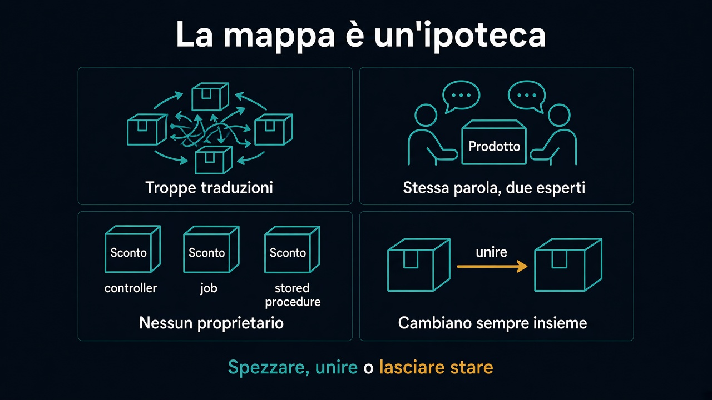

# 6. Quando il confine si muove

*Non è inciso nella pietra*

← [Tradurre al bordo](5.tradurre-al-bordo.md) · [Indice](README.md)

---

## Segnali, non dogmi

La mappa è un'ipotesi. Si verifica sulle feature, non sulla slide.

**Troppe traduzioni su ogni modifica.** Ogni schermata attraversa tre modelli per un campo. Forse un pezzo sta nel contesto sbagliato, o manca un concetto esplicito di correlazione (un id condiviso, non una classe condivisa).

**Due esperti litigano sulla stessa parola nello stesso codice.** Il contesto è troppo largo. «Prodotto» sta facendo due lavori.

**Nessuno sa chi possiede un concetto.** Il confine è invisibile, non assente. Lo sconto vive nel controller, nel job notturno e in una stored procedure: tre padroni, nessuna regola.

**Due scatoloni che cambiano sempre insieme.** Unire è lecito. Due nomi sulla mappa e una sola vita nel codice sono cerimonia. Quando quegli scatoloni diventano moduli — e quando un modulo merita un processo — è il [percorso 10](../10.Moduli/README.md).

## Cosa ricordare

| Pezzo | Ruolo |
|---|---|
| **Sottodominio** | Area del problema, anche senza codice |
| **Bounded context** | Modello + linguaggio con un dentro/fuori |
| **Parola** | Vale solo dentro; fuori si traduce |
| **Mappa** | Chi dipende da cosa — non le chiamate di rete |
| **Bordo** | Traduzione, non import dell'entità altrui |

Un modello unico grande quanto l'azienda è il fango del [percorso 1](../1.DDD-vs-framework/README.md), con etichette migliori.

Riferimento utile: [Bounded Context, Martin Fowler](https://martinfowler.com/bliki/BoundedContext.html).

## Cosa succede ora

La mappa ha un dentro: **Vendite**. Il [prossimo percorso](../3.DDD-tattico/README.md) ci entra e dà forma alle regole dell'ordine — «un confermato non si modifica» — senza trascinarsi dietro catalogo e magazzino.

---

## Percorso completo

1. [Parole, esempi, ambiguità](1.parole-esempi-ambiguita.md)
2. [Sottodominio e bounded context](2.sottodominio-e-bounded-context.md)
3. [Seguire una parola](3.seguire-una-parola.md)
4. [Context map](4.context-map.md)
5. [Tradurre al bordo](5.tradurre-al-bordo.md)
6. **Quando il confine si muove** (sei qui)

← [Torna all'indice](README.md) · [Mappa dei percorsi](../README.md)
