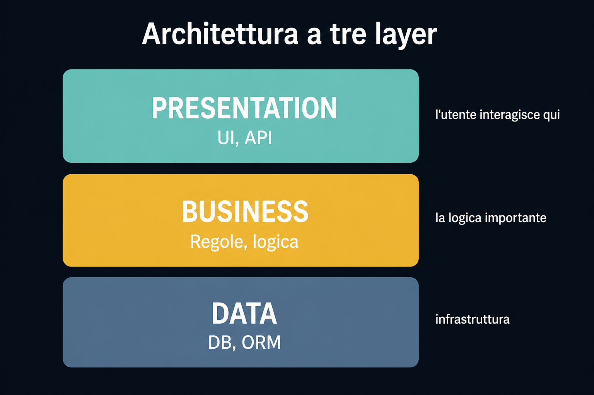
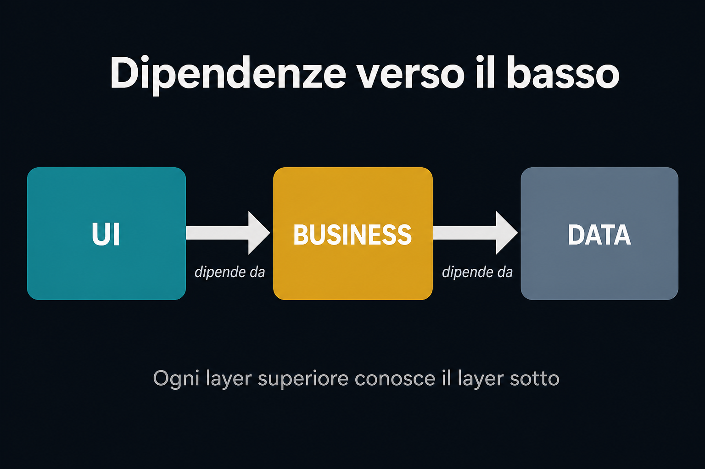
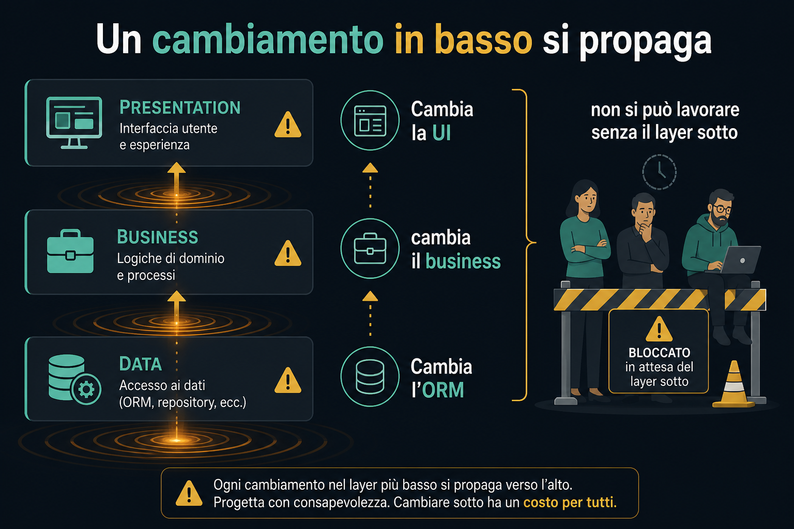

# 1. Origine

*Quando il team dell'ORM chiese una pausa di settimane*

← [Indice](README.md) · [Dentro e fuori →](2.dentro-e-fuori.md)

---

## La scintilla

Alistair Cockburn stava lavorando a un progetto.

Il team responsabile dell'**ORM** (sì, una volta si costruivano in casa) gli disse:

> Dovremo rifare tutto. Meglio se il resto del team si ferma qualche settimana e riprende quando l'ORM sarà pronto.

Suona ridicolo. Ed è **la storia di origine** di molti stili architetturali che usiamo oggi.

## Cosa succedeva prima

Quando si iniziava a programmare, **l'architettura a tre layer** era *the thing*. Ancora oggi è diffusissima.

La famosa **lasagna** dello sviluppo software:

1. **Presentation** — tutto ciò con cui l'utente interagisce (UI, API)
2. **Business** — le regole, la logica importante
3. **Data** — infrastruttura, database, ORM

## Il flusso delle dipendenze

Le dipendenze vanno **dall'alto verso il basso**.

Ogni layer superiore **conosce** il layer sotto.

Il business sa che esiste un database. L'UI sa come è fatto il business. Il data layer è il fondamento su cui poggia tutto.

## I problemi della lasagna

### Accoppiamento

Un cambiamento in basso **si propaga** verso l'alto.

Cambia l'ORM → cambia il business → cambia la UI.

### Testabilità

Testare in **isolamento** è difficile. Senza il layer sotto, i layer sopra faticano a lavorare.

È esattamente quello che è successo a Cockburn: **non si poteva continuare a lavorare** mentre l'ORM veniva ricostruito.

---

← [Indice](README.md) · **Avanti:** [2. Dentro e fuori →](2.dentro-e-fuori.md)
