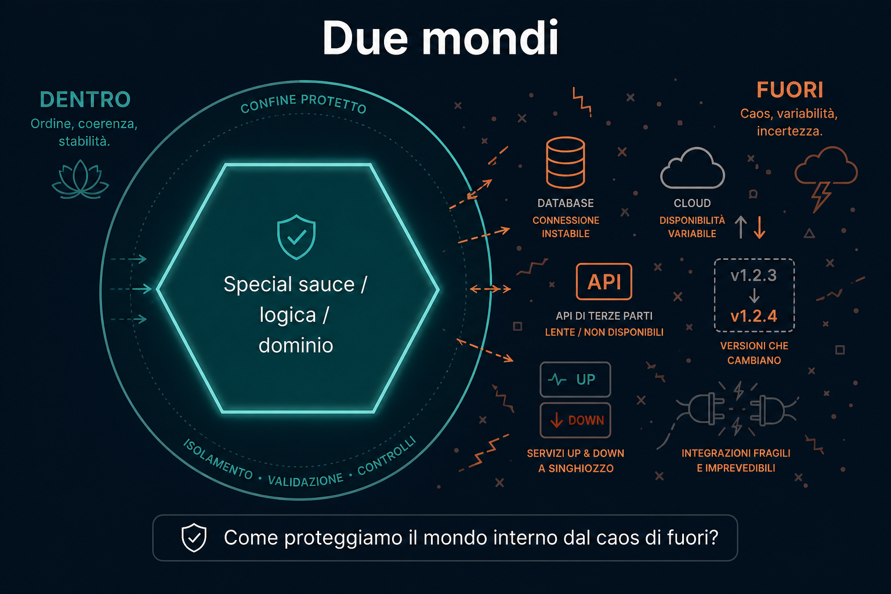

# 2. Dentro e fuori

*Proteggere il cuore dal mondo imprevedibile*

← [Origine](1.origine.md) · [Indice](README.md) · [Ports e Adapters →](3.ports-e-adapters.md)

---

## Due mondi

Cockburn si rese conto che ogni sistema ha **due parti**.

### Dentro

La parte più importante. Tutta la logica. Tutto ciò che rende l'applicazione **speciale**.

La *special sauce*.

### Fuori

Un mondo **imprevedibile**. Dipendenze che cambiano versione. Servizi up o down. Tecnologie che non controlli.

## La domanda chiave

Come proteggiamo il **mondo interno** dal caos di fuori?

Il dominio non dovrebbe sapere se i dati stanno in MySQL, su S3, o in un file FTP.

Non dovrebbe sapere se la richiesta arriva da un'API, da una UI, o da un messaggio Kafka.

## Lo stesso pattern, ovunque

Quando il codice parla con un **database**, in realtà segue lo stesso schema di quando parla con un'**API**.

Serve un **contratto**: un'astrazione della tecnologia dall'altra parte.

I pattern di utilizzo sono gli stessi. Cambia solo *come* si traduce.

Quel contratto è il **port**. La traduzione è l'**adapter**.

---

← [1. Origine](1.origine.md) · **Avanti:** [3. Ports e Adapters →](3.ports-e-adapters.md)
