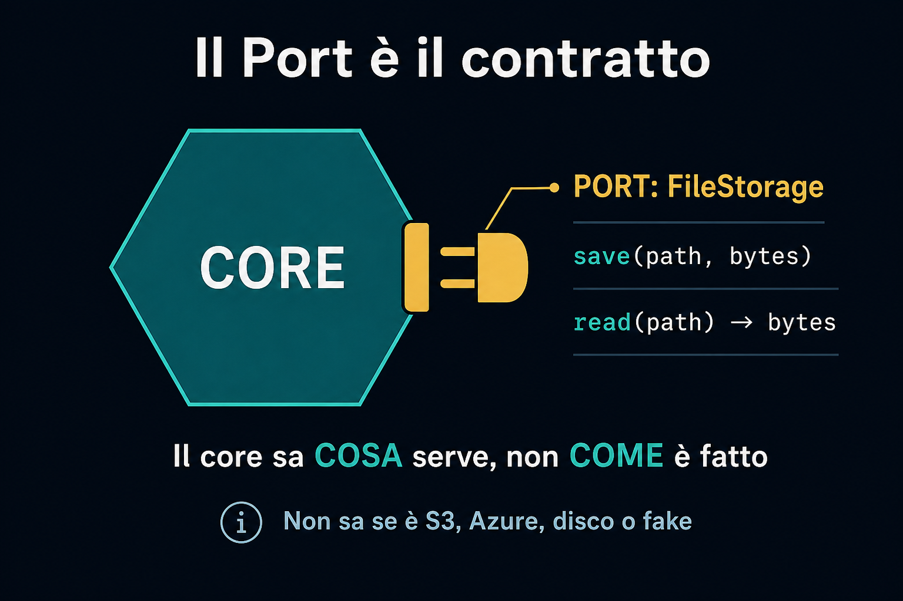
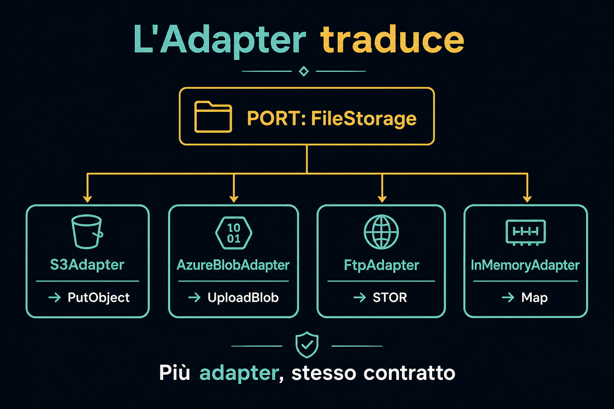
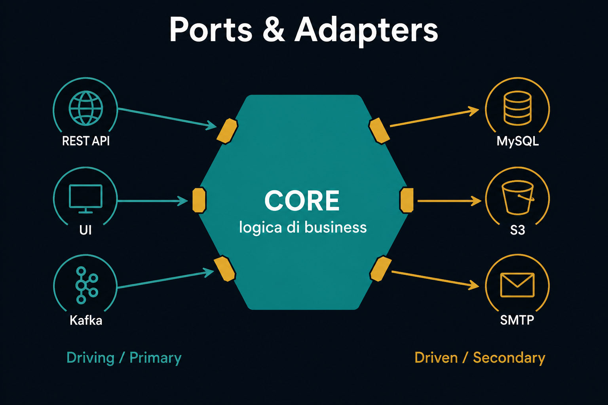
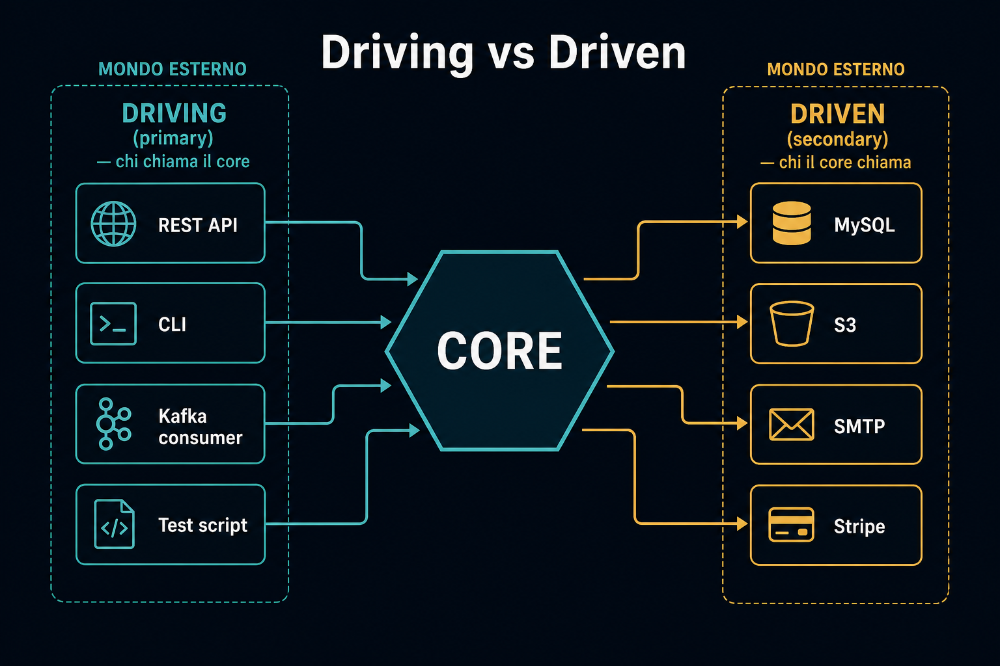
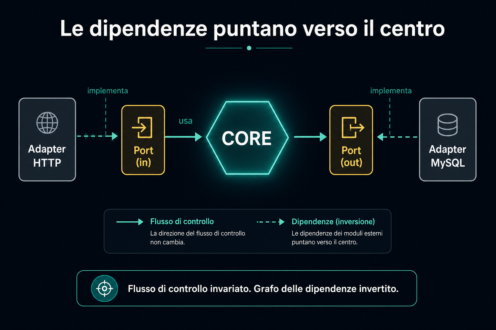

# 3. Ports e Adapters

*Contratti al bordo, traduzioni fuori*

← [Dentro e fuori](2.dentro-e-fuori.md) · [Indice](README.md) · [Perché un esagono →](4.perche-un-esagono.md)

---

## I Ports

Il **port** è il contratto.

Sta sul bordo del core. Dice *cosa* serve, non *come* è fatto.

Il core sa solo: *ho bisogno di salvare un file*.

Non sa se è S3, Azure Blob, un disco locale o un fake in memoria.

## Gli Adapters

L'**adapter** traduce il contratto nella tecnologia scelta. È un layer di traduzione. Niente di più.

Più adapter possono soddisfare **lo stesso port**, in modo indipendente.

## Da qui il nome

Hexagonal Architecture è anche nota come **Ports and Adapters**.

I ports stanno sui bordi della *special sauce*. Gli adapters agganciano il mondo esterno **senza contaminare** il core.

## Due famiglie di adapter

Non tutti gli adapter sono uguali. Si dividono in **due gruppi**.

| | **Driving · Primary** | **Driven · Secondary** |
|---|---|---|
| Ruolo | **Guidano** l'applicazione | **Sono usati** dall'applicazione |
| Direzione | Qualcosa di esterno chiede al core di fare un lavoro | Il core produce un effetto sul mondo esterno |
| Esempi | Request HTTP, UI, app mobile, message handler (Kafka) | Persistenza SQL/NoSQL, storage file, email, API di terzi |

A sinistra: *chi chiama il core*. A destra: *chi il core chiama*.

## Il flusso non cambia. Le dipendenze sì.

Il **flusso di controllo** è lo stesso della lasagna:

> Request → logica → infrastruttura → risposta

La **regola delle dipendenze** è diversa:

> Tutte le frecce puntano **verso l'interno**.

L'esagono **non sa nulla** di ciò che sta fuori. Conosce solo i propri contratti.

Inversion of Control, applicata all'architettura.

---

← [2. Dentro e fuori](2.dentro-e-fuori.md) · **Avanti:** [4. Perché un esagono →](4.perche-un-esagono.md)
