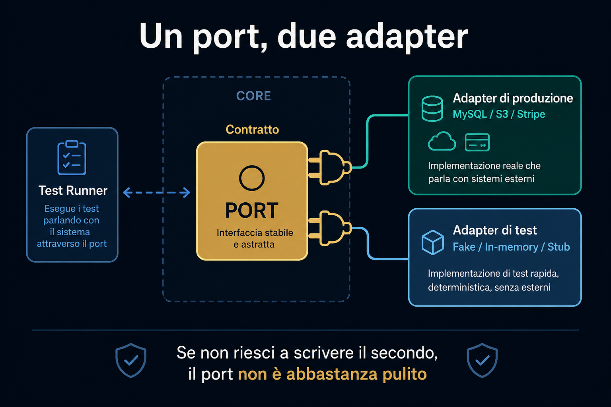

# 5. Perché usarla

*Semplicità, decisioni tarde, test, libertà*

← [Perché un esagono](4.perche-un-esagono.md) · [Indice](README.md) · [Sintesi →](6.sintesi.md)

---

## È semplice — e questo è il punto

Se rispetti la semplicità, **funziona**.

Il concetto è facile da capire. Ti invita a partire da ciò che conta: **la logica**, l'esagono.

Non ti impone un rituale di layer, cartelle e pattern per ogni richiesta.

## Ritardare le decisioni importanti

Inizi dal core. Le scelte tecnologiche arrivano **quando hai più informazioni**.

Esempio classico: *quale datastore per questo problema?*

Non lo decidi il giorno zero. Lo decidi quando il dominio ti ha detto di cosa ha davvero bisogno.

L'adapter si innesta dopo. Il port c'era già.

## Libertà di stile

Hexagonal **non ti obbliga** a un'unica convenzione.

- **Vuoi DDD?** Puoi farlo. Entità, value object, aggregate: stanno nel core.
- **Vuoi slice per feature?** Puoi farlo. Ogni feature ha i suoi ports e i suoi adapters.

Rispetti le regole di base. Il resto è tuo.

A differenza di stili in cui *ogni cosa* deve attraversare lo stesso flusso di layer — anche quando non ha senso.

## Testabilità by design

Puoi testare l'esagono **senza tecnologie esterne**.

I test sono:

- **facili da mantenere**
- **non flaky**
- **veloci**

Tutto grazie all'astrazione di default: i ports.

Se testi tutto **attraverso i ports**, testi i **contratti**. I contratti sono **stabili**. Ciò che sta *dentro* l'esagono può cambiare: sono dettagli di implementazione.

## Una regola utile: un port, due adapter

Per ogni port, almeno **due** adapter:

1. quello **di produzione** (MySQL, S3, Stripe, …)
2. quello **di test** (fake, in-memory, stub)

Se non riesci a scrivere il secondo, il port probabilmente **non è un contratto abbastanza pulito**.

## Indipendenza dagli strumenti

Ogni tecnologia esterna diventa **sostituibile**.

Cambiare database è raro. Resta una buona idea, per due motivi.

### Quando succede davvero

Scala, volumi, vincoli nuovi. Il codice di accesso è nell'adapter: il cambio è **contenuto**. Qualche ritocco ai ports, non al core.

### Lo fai già ogni giorno

Nei test **sostituisci** già la tecnologia di produzione con un double.

L'assicurazione la stai già pagando — e rende.

> Potrebbe non capitare spesso. Ma è un'assicurazione.
> E si ripaga in fretta, perché **i test sono già uno swap di tecnologia**.

Un fake in memoria *è* un adapter diverso sullo stesso port. Se lo swap per i test è facile, lo swap per produzione lo sarà altrettanto.

## Hexagonal e Clean Architecture

Oggi si tende a usare **Clean Architecture** per tutto. Non è sempre la scelta migliore.

Hexagonal è **alle radici** di Clean Architecture.

Stessa idea: dipendenze verso il centro, core isolato, dettagli fuori.

Hexagonal è più **leggera**: meno layer obbligatori, più libertà su come organizzare l'interno.

---

← [4. Perché un esagono](4.perche-un-esagono.md) · **Avanti:** [6. Sintesi →](6.sintesi.md)
