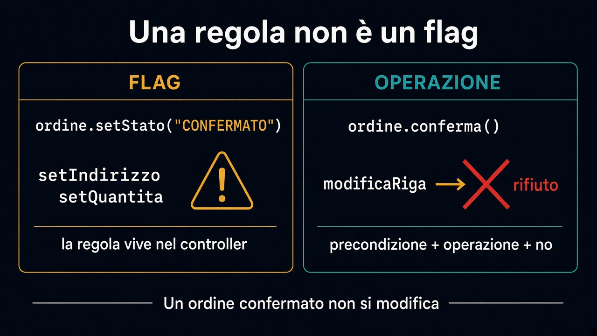

# 1. Dalla frase al comportamento

*Una regola non è un flag*

← [Indice](README.md) · [Value object →](2.value-object.md)

---

## Siamo in Vendite

Il [percorso 2](../2.DDD-strategico/README.md) ha messo catalogo e magazzino fuori da questo modello. Qui conta una frase sola, detta da chi vende:

> Un ordine confermato non si modifica.

Non si parte dalla tabella `orders`. Si parte da ciò che il business può falsificare.

## Flag vs operazione

La versione che finisce nel fango:

```text
ordine.setStato("CONFERMATO");
// più tardi, in un altro file:
ordine.setIndirizzo(nuovo);
ordine.getRighe().get(0).setQuantita(0);
```

Lo stato è una stringa. La regola è un `if` nel controller — o in tre controller. Tra sei mesi qualcuno aggiunge un endpoint e se la dimentica.

Una regola ha **precondizioni**, un'**operazione** e un **rifiuto** esplicito:

- bozza: puoi aggiungere una riga, cambiare l'indirizzo
- `conferma()`: da qui le modifiche alle righe non passano
- tentativo dopo: no. Non un log. Un rifiuto che chi chiama deve vedere

Il comportamento *è* il modello. Il campo stato, se esiste, è un dettaglio sotto.



## Mini-scenario

1. Bozza con due righe. Si cambia una quantità. Ok.
2. `conferma()`. L'ordine è un impegno.
3. Qualcuno prova a togliere una riga o a spostare la spedizione. No.

Finché questo non sta in un posto solo, ogni canale (UI, API, job) riscriverà la regola a modo suo — lo stesso accoppiamento del [percorso 1](../1.DDD-vs-framework/README.md), solo più educato.

I prossimi capitoli danno i pezzi: prima i valori che non mentono, poi chi ha identità, poi il confine che protegge la frase.

---

← [Indice](README.md) · **Avanti:** [2. Value object →](2.value-object.md)
