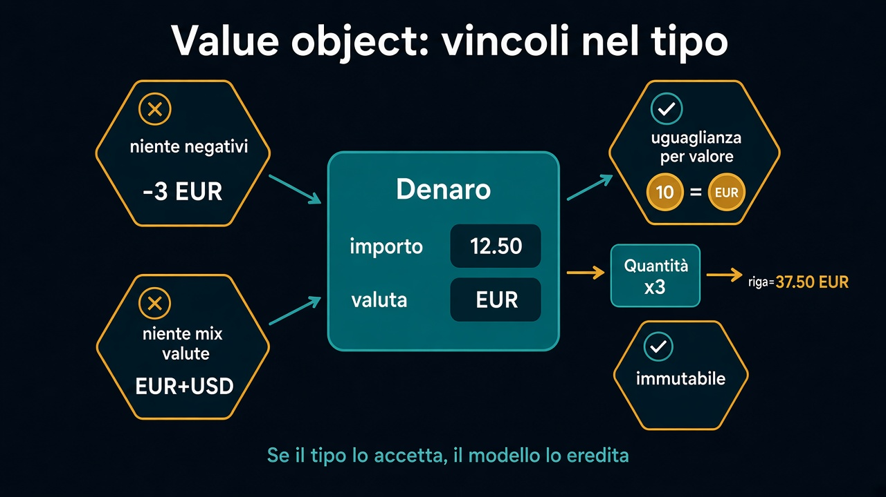

# 2. Value object

*Denaro e quantità che si rifiutano di essere sbagliati*

← [Dalla frase al comportamento](1.dalla-frase-al-comportamento.md) · [Indice](README.md) · [Entità →](3.entita.md)

---

## Valore, non identità

Un value object si riconosce così: **uguaglianza per valore**, niente identità, di solito immutabile. Due `Denaro(10, EUR)` sono la stessa cosa. Non ha senso “aggiornare” quello di sinistra.

Il punto non è la classe. È **non rappresentare stati invalidi**.



## Denaro

`BigDecimal totale` più `String valuta` sparsi in tre file: puoi sommare euro e dollari, puoi avere un totale negativo, puoi arrotondare in tre modi.

Un `Denaro` chiude i buchi:

- importo e valuta **insieme**
- niente somma tra valute diverse
- niente importi sotto zero, se per voi il denaro di una riga non lo è
- arrotondamento **in un posto solo**

Chi usa `riga.prezzo().piu(altra)` non decide la scala. Chi costruisce `new Denaro(-3, "eur")` non passa.

## Quantità

Una `Quantita` positiva (o zero, se una riga vuota è un valore e non un buco). Il prezzo di riga è `denaro × quantità` — un'operazione del tipo, non un `totale = prezzo * qty` dimenticato nel mapper.

```text
Denaro listino = Denaro.euro("12.50");
Quantita n = Quantita.di(3);
Denaro riga = listino.per(n);   // 37.50 EUR
```

Due `Quantita(3)` sono uguali. Non le confronti per riferimento. Non le muti: ne produci un'altra.

## Cosa non è questo capitolo

Non è JPA embeddable, non è `record` vs `class`. Il linguaggio è un dettaglio. Il vincolo no: se il tipo lo accetta, il resto del modello lo eredita.

Il prossimo capitolo: cosa *resta se stesso* quando i numeri cambiano. Quello ha un'identità.

---

← [1. Dalla frase al comportamento](1.dalla-frase-al-comportamento.md) · [Indice](README.md) · **Avanti:** [3. Entità →](3.entita.md)
