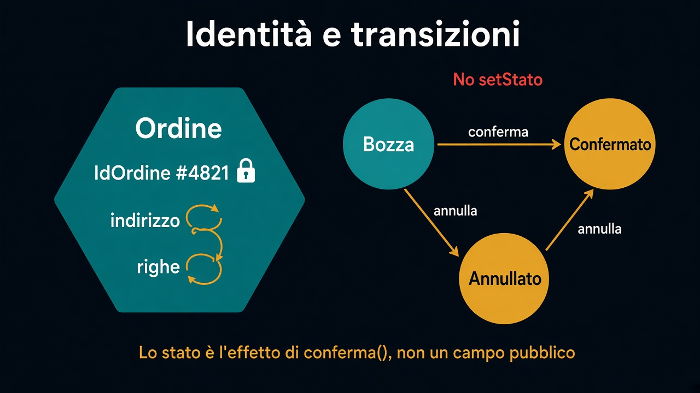

# 3. Entità

*La stessa cosa che cambia*

← [Value object](2.value-object.md) · [Indice](README.md) · [Aggregate →](4.aggregate.md)

---

## Cosa resta lo stesso

Un'entità ha un'**identità** che sopravvive ai dati. `IdOrdine` non cambia se cambi l'indirizzo o una riga. Due ordini con lo stesso totale non sono lo stesso ordine. Due `Denaro(10, EUR)` sì — quelli non sono entità.

L'identità risponde a: *è questa cosa, o un'altra?*

## Stati come transizioni

Bozza → confermato → annullato. Non una stringa libera nel database, non un enum che chiunque setta.

Operazioni, non setter:

```text
ordine.conferma();    // solo da bozza
ordine.annulla();     // da bozza o da confermato, se la regola lo permette
ordine.modificaRiga(id, quantita);  // solo in bozza
```

`setStato("CONFERMATO")` non esiste. Lo stato è l'effetto di `conferma()`, non un campo pubblico.



Un passaggio che la frase vieta **non è un ramo da dimenticare**: è un rifiuto nel metodo.

## Perché conta

Senza identità mescoli valori e cose. Senza transizioni, lo stato è un dato e la regola vive altrove — di nuovo il modello anemico del [percorso 1](../1.DDD-vs-framework/README.md).

Qui l'ordine è *la stessa cosa che cambia*. Il capitolo dopo decide **insieme a chi** deve cambiare: le righe non si toccano da sole.

---

← [2. Value object](2.value-object.md) · [Indice](README.md) · **Avanti:** [4. Aggregate →](4.aggregate.md)
