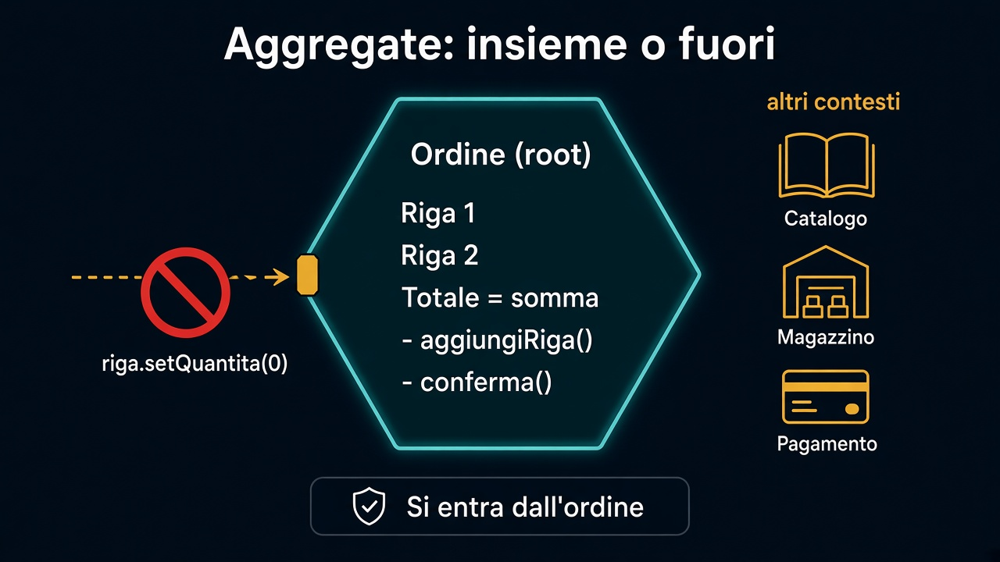

# 4. Aggregate

*Cosa deve cambiare nello stesso momento*

← [Entità](3.entita.md) · [Indice](README.md) · [Use case e dominio →](5.use-case-e-dominio.md)

---

## Il confine dell'invariante

Un aggregate è il pezzo che proteggi **insieme**. Non è un grafo di oggetti. È: *quali regole si rompono se tocco un pezzo senza gli altri?*

`Ordine` + `RigaOrdine`:

- il totale è la somma delle righe
- un ordine confermato non è vuoto
- una riga non si modifica da sola dopo la conferma — perché la conferma è dell'ordine, non della riga

Si entra dalla **root**: `ordine.aggiungiRiga(...)`, `ordine.modificaRiga(...)`. Non `riga.setQuantita(0)` ottenuto da una lista pubblica.



```text
ordine.aggiungiRiga(idProdotto, quantita, prezzoCongelato);
ordine.conferma();          // fallisce se non c'è nessuna riga
ordine.righe().get(0)...    // in lettura, magari; in scrittura, no
```

## Cosa resta fuori

Catalogo, magazzino, pagamento: [altri contesti](../2.DDD-strategico/4.context-map.md). Non stanno nell'aggregate perché non devono cambiare nello stesso momento, nello stesso linguaggio.

Confermare un ordine è un **fatto** di Vendite. Chi ascolta — magazzino che riserva scorta — sta oltre il confine. L'ordine non importa `Pallet` per “essere DDD”.

## Cosa non è questo capitolo

Non è la transazione del database, non è un lock, non è “un aggregate = una tabella”. La persistenza arriverà. Qui conta il bordo del modello: dentro, gli invarianti tengono; fuori, altri modelli, altre regole.

Il prossimo capitolo: se la regola sta nell'ordine, **cosa resta** a chi orchestra il caso d'uso.

---

← [3. Entità](3.entita.md) · [Indice](README.md) · **Avanti:** [5. Use case e dominio →](5.use-case-e-dominio.md)
