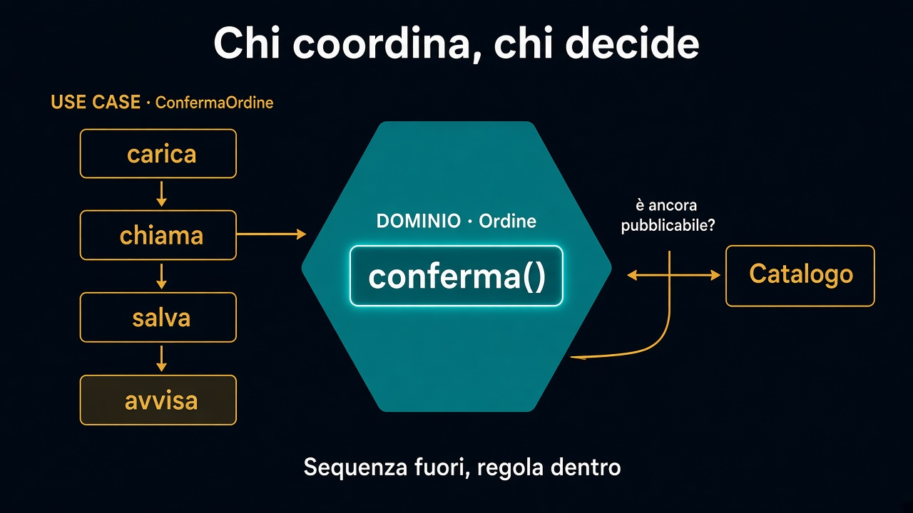

# 5. Use case e dominio

*Chi coordina, chi decide*

← [Aggregate](4.aggregate.md) · [Indice](README.md) · [Prima / dopo →](6.prima-dopo.md)

---

## Due lavori

**Dominio:** custodisce gli invarianti. `ordine.conferma()` sa se sei in bozza, se ci sono righe, se la frase del business tiene.

**Use case:** carica, chiama, salva, avvisa. Sequenza, non regola.



```text
// ConfermaOrdine — coordina
Ordine ordine = ordini.diId(id);
ordine.conferma();
ordini.salva(ordine);
// poi: avvisa, evento, email — fuori dal modello
```

Un `OrdineService` che ricalcola IVA, spezza righe e manda mail **è il dominio sparso**. Lo use case è diventato il posto dove vive la regola — e ogni nuovo canale la ricopia.

## Tra contesti, non dentro l'ordine

«Non confermare se il catalogo ha dismesso il prodotto» non è un `if` in `conferma()`.

Il catalogo è [un altro contesto](../2.DDD-strategico/3.seguire-una-parola.md). Lo use case **chiede** (è ancora pubblicabile?), poi decide se chiamare `ordine.conferma()`. L'ordine non importa la scheda prodotto.

Se una regola non sta su un solo aggregate — raro — può esistere un servizio di dominio. Non cercarlo in anticipo. Prima prova: è coordinazione (use case) o invariante di *questa* cosa (aggregate)?

## Ponte in avanti

Lo use case, più avanti, parlerà a **porte** (carica, salva, notifica). Il modello no. Una frase: nel [percorso sull'esagono](../4.Hexagonal-architecture/README.md) quella sequenza sta sul bordo del core, e `carica` e `salva` diventano [un contratto](../7.Persistenza/2.repository-e-un-port.md) nel percorso sulla persistenza. La regola resta dove l'abbiamo messa.

La fatica sta nell'aggregate. Lo use case resta sottile — [stesso gesto](../5.PhilosophyofSoftwareDesign/8.tira-complessita-verso-il-basso.md) degli appunti sulla complessità.

---

← [4. Aggregate](4.aggregate.md) · [Indice](README.md) · **Avanti:** [6. Prima / dopo →](6.prima-dopo.md)
