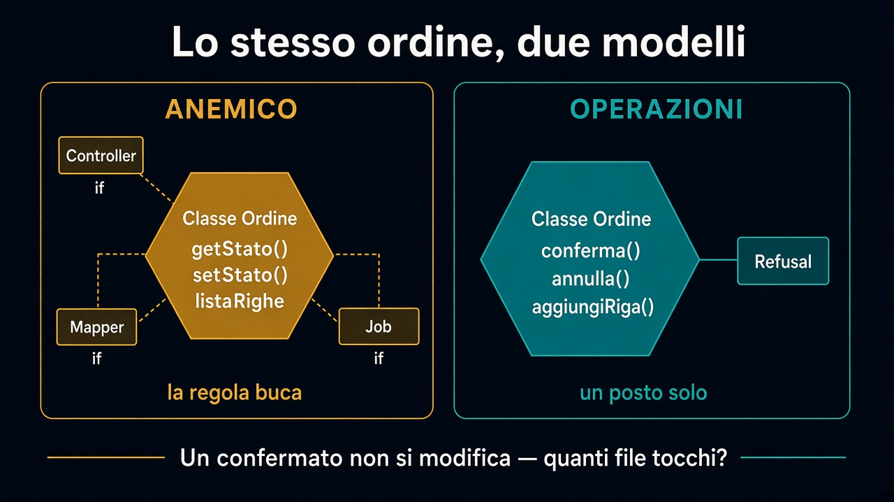

# 6. Prima / dopo

*Lo stesso ordine, due modelli*

← [Use case e dominio](5.use-case-e-dominio.md) · [Indice](README.md)

---

## Cosa cambia tra sei mesi

La frase è la stessa: *un ordine confermato non si modifica*. Cambia **quanti posti** devi toccare per farla rispettare.

| | Anemico | Operazioni di dominio |
|---|---|---|
| Modello | `get` / `set`, lista righe pubblica | `conferma()`, `annulla()`, `aggiungiRiga()` |
| Dove sta la regola | Controller, mapper, job | L'operazione rifiuta |
| Nuovo canale | Ricopi l'`if` | Chiami lo stesso metodo |
| Catalogo / magazzino | Campi in più sulla stessa classe | Fuori: altri [contesti](../2.DDD-strategico/README.md) |

Prima: `setStato` più tre `if` sparsi. Aggiungi un endpoint, la regola buca.

Dopo: i setter che bypassano non ci sono. Chi vuole “sistemare una riga” passa da `modificaRiga` e scopre il no. I caller che compilavano contro i campi pubblici smettono di compilare — meglio un rosso oggi che un ordine mutato in produzione.

## Mappa dei pezzi

| Pezzo | Ruolo |
|---|---|
| **Contesto** | Vendite, non l'azienda intera (percorso 2) |
| **Value object** | Denaro, quantità: vincoli nel tipo |
| **Entità** | Identità + transizioni |
| **Aggregate** | Invarianti che stanno insieme |
| **Use case** | Carica, chiama, salva — non decide la regola |

Inizia dalla **frase**. I tipi vengono dopo. Il core è questo modello.

## Cosa succede ora

Il [prossimo percorso](../4.Hexagonal-architecture/README.md) protegge quel core: contratti sul bordo, traduzioni fuori, dipendenze verso l'interno. Entità, value object, aggregate: stanno già dove l'esagono li aspetta.

---

## Percorso completo

1. [Dalla frase al comportamento](1.dalla-frase-al-comportamento.md)
2. [Value object](2.value-object.md)
3. [Entità](3.entita.md)
4. [Aggregate](4.aggregate.md)
5. [Use case e dominio](5.use-case-e-dominio.md)
6. **Prima / dopo** (sei qui)

← [Torna all'indice](README.md)
