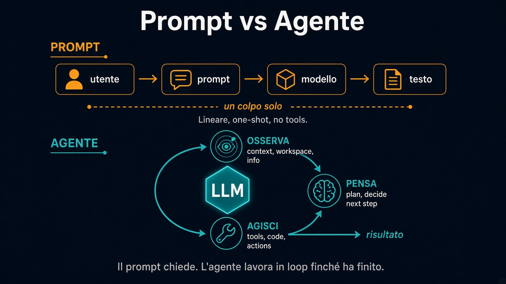

# 2. Come funzionano gli agenti

*Il prompt chiede. L'agente gira in loop*

← [Introduzione](1.introduzione.md) · [Indice](README.md) · [Agent harness →](3.agent-harness.md)

---

## Prompt: un colpo solo

Flusso lineare:

**utente → prompt → modello → testo**

Chiedi. Ottieni una risposta. Fine — finché non riscrivi il prompt.

Niente tool obbligatori. Niente piano autonomo. Il “prossimo passo” lo decidi tu.

## Agente: obiettivo → risultato

L'agente non si ferma alla prima risposta. Gira in un **agent loop** finché le condizioni di completamento sono soddisfatte (quelle che hai messo nel brief: “cerca 10 fonti e fai le slide”, “builda e verifica in preview”, ecc.).

### Il loop in tre mosse

1. **Osserva** — guarda contesto, workspace, info disponibili, output del passo prima
2. **Pensa** — decide il prossimo passo, aggiorna il piano, valuta le opzioni
3. **Agisci** — usa tool, scrive codice, lancia comandi, produce artefatti

Poi di nuovo: osserva cosa è cambiato → pensa → agisci. Finché c’è un **risultato**, non solo del testo.

## Cosa c’è dentro un agente

Quattro pezzi, non uno solo:

| Pezzo | Ruolo |
|---|---|
| **LLM** | Il “motore”: ragiona e sceglie |
| **Loop** | Tiene vivo Osserva → Pensa → Agisci (non one-shot) |
| **Tool + contesto** | Mani e memoria di lavoro: file, API, workspace |
| **Harness** | Il telaio (Claude Code, Codex, Cowork, …): fa girare loop, tool e contesto insieme |

Il modello da solo parla. Con loop + tool + harness **fa**.

## La differenza che conta

- **Prompt engineering**: affinare la domanda per una risposta migliore.
- **Agentic**: dare un obiettivo chiaro, criteri di “fatto”, e lasciare che il loop lavori — osservando, decidendo, agendo.

Stesso cervello (LLM). Contratto diverso: dalla risposta al risultato.

---

← [1. Introduzione](1.introduzione.md) · **Avanti:** [3. Agent harness →](3.agent-harness.md)
