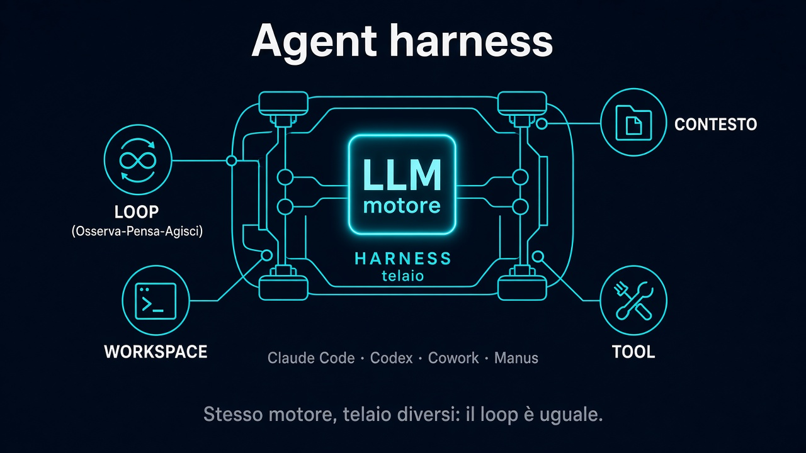

# 3. Agent harness

*Il telaio che fa girare il loop*

← [Come funzionano gli agenti](2.come-funzionano-gli-agenti.md) · [Indice](README.md) · [Memoria e contesto →](4.memoria-e-contesto.md)

---

## Motore e telaio

Il modello (Claude, GPT, Gemini, …) è il **motore**: ragiona, sceglie, scrive.

Da solo non basta. Serve un **harness** — il *telaio* — che tiene insieme:

- il **loop** Osserva → Pensa → Agisci
- il **workspace** (file, terminale, progetto)
- il **contesto** che carichi all’avvio
- i **tool** collegati all’ambiente

## Cosa fa l’harness

Non “pensa” al posto del modello. **Orchestra**:

1. riceve l’obiettivo
2. fa partire (e riparte) il loop
3. espone tool e file al modello
4. restituisce i risultati di ogni azione nel giro successivo
5. si ferma quando i criteri di “fatto” sono soddisfatti (o quando blocchi tu)

Senza harness hai una chat. Con harness hai un agente.

## Stesso loop, prodotti diversi

| Harness (esempi) | Ruolo tipico |
|---|---|
| Claude Code, Codex | coding agent nel repo |
| Cowork, Manus, … | agent “da lavoro” con tool e workspace |

Cambia l’interfaccia e i connector. **Non cambia l’idea**: motore + loop + contesto + tool.

Impari il loop su uno → ti muovi sugli altri senza ripartire da zero.

## Perché importa

Scegliere l’harness non è “scegliere il modello migliore”. È scegliere **dove** gira l’agente: quali file vede, quali tool può usare, come gli dai onboarding.

Il motore è sostituibile. Il telaio decide *cosa può fare* nel mondo reale.

---

← [2. Come funzionano gli agenti](2.come-funzionano-gli-agenti.md) · **Avanti:** [4. Memoria e contesto →](4.memoria-e-contesto.md)
