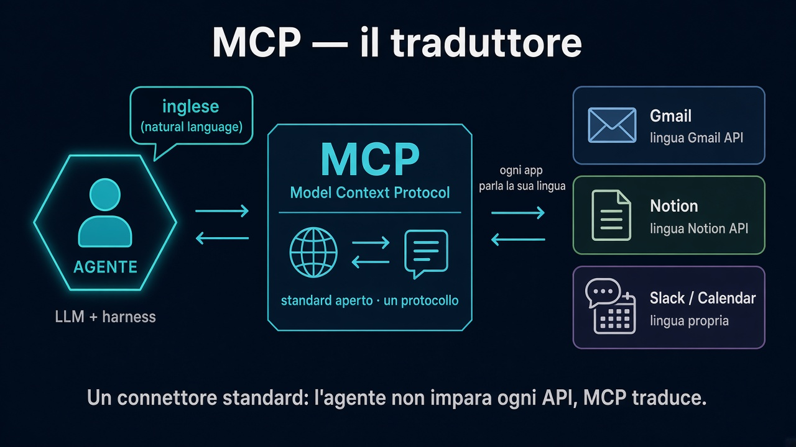

# 5. MCP — il traduttore

*L’agente parla inglese. Le app parlano lingue diverse.*

← [Memoria e contesto](4.memoria-e-contesto.md) · [Indice](README.md) · [Skills →](6.skills.md)

---

## Il problema

L’agente (LLM + harness) ragiona in **linguaggio naturale**.

Gmail, Notion, Calendar, Stripe… ognuno ha la **sua** API, i suoi oggetti, le sue regole. Lingue diverse.

Senza uno standard, ogni integrazione è un adattatore su misura: fragile, lento da costruire, difficile da riusare tra harness.

## MCP in una frase

**MCP** (*Model Context Protocol*) è un **protocollo aperto** (nato in casa Anthropic) che sta in mezzo: traduce tra ciò che l’agente capisce e ciò che le app espongono.

Come nel video (~30:27–31:43): pensa a un **traduttore universale**. Tool 1 parla inglese, tool 2 spagnolo, tool 3 giapponese — MCP è il layer che unifica tutto in una lingua che il modello sa usare.

## Cosa cambia in pratica

| Prima | Con MCP |
|---|---|
| Integrazione custom per ogni app | Un connettore standard |
| L’agente “non arriva” a inbox/Notion | Può leggere, scrivere, agire via tool |
| Ogni harness reinventa i bridge | Stesso protocollo su Claude Code, Cowork, Codex, … |

Nell’harness di solito: Settings → Connectors (o equivalente) → login all’app → il server MCP espone i tool al loop.

## Dove si innesta

Nel giro **Agisci** del loop:

1. l’agente decide “mi serve la inbox di oggi”
2. chiama un tool esposto via MCP (es. Gmail)
3. MCP parla la lingua dell’API
4. il risultato torna nel contesto → di nuovo **Osserva / Pensa**

Senza MCP l’agente resta chiuso nel workspace. Con MCP mette le **mani** sulle app che già usi.

## Cosa ricordare

- MCP non è il modello: è il **cavo standard** tra modello e mondo.
- Non risolve i permessi da solo: decidi tu *cosa* collegare e con quali privilegi (read-only dove puoi).
- Contesto snello + tool MCP = obiettivo in linguaggio semplice (“riassumi la mail di oggi e crea il progetto su Notion”) senza prompt da romanzo.

---

← [4. Memoria e contesto](4.memoria-e-contesto.md) · **Avanti:** [6. Skills →](6.skills.md)
