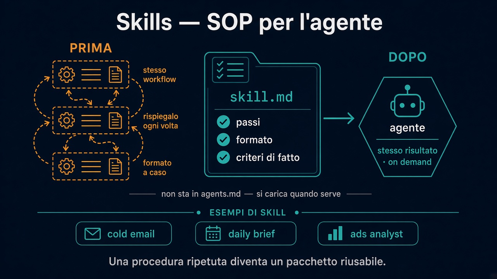

# 6. Skills — SOP per l’agente

*Una procedura ripetuta diventa un pacchetto riusabile*

← [MCP](5.mcp.md) · [Indice](README.md)

---

## Il problema

Fai spesso le stesse cose: cold email, brief del mattino, analisi ads, referral.

Se le rispieghi ogni volta nel prompt:

- sprechi tempo
- il formato cambia
- intasi `agents.md` / `memory.md` con dettagli tattici

Serve una **SOP per l’AI**: passi, formato, criteri di “fatto” — in un file a parte.

## Cos’è una skill

Una **skill** è un workflow ripetibile impacchettato (di solito un markdown tipo `skill.md` / cartella in `skills/`).

Contiene tipicamente:

- **quando** usarla
- i **passi** del loop (cosa osservare, cosa produrre)
- il **formato** dell’output
- i **criteri di completamento**

Non sta nel file principale. Si **carica on demand** — così la finestra di contesto resta libera (vedi [Memoria](4.memoria-e-contesto.md)).

## Perché esistono

| Senza skill | Con skill |
|---|---|
| Prompt lungo ogni volta | “Lancia cold email” / invoca la skill |
| Output inconsistente | Stesso formato, stessi check |
| Preferenze e SOP mischiate in memoria | Tattico in `skills/`, preferenze in `memory.md` |

MCP dà le **mani** (Gmail, Notion, …). La skill dà la **ricetta**.

## Come nasce (dal video)

Due strade tipiche:

1. **Dopo averlo fatto una volta** — compi il workflow a mano con l’agente, poi: “impacchetta questo processo come skill”.
2. **Da materiale esistente** — transcript di un corso, guida, SOP umana → convertila in skill strutturata.

Esempi: cold email, daily brief, ads analyst, referral.

## Skills + schedule

Alcuni harness permettono di **schedulare** una skill (es. brief ogni mattina alle 8).

Una volta scritta, quella procedura si ripete da sola: compounding, non one-shot.

Più skill si possono anche **incatenare**: brief → ricerca prep meeting → bozza mail.

## Cosa ricordare

- Skill = SOP riusabile, non un prompt monouso.
- Vive fuori da `agents.md`: link dall’indice, carico quando serve.
- Tool (MCP) + skill + contesto snello = obiettivo corto, risultato ripetibile.

---

← [5. MCP](5.mcp.md) · [Indice](README.md)
