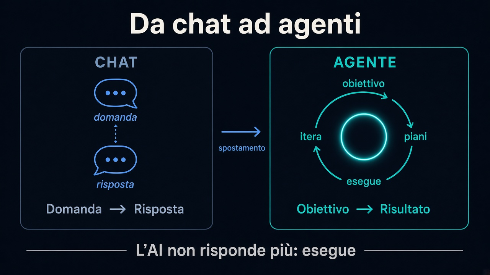

# Agentic AI

Come si passa dalla chat all'agente — e perché cambia il modo di lavorare col modello.

Ispirato a [*Building AI Agents that actually work*](https://www.youtube.com/watch?v=eA9Zf2-qYYM) di Remy Gaskell (con Greg Eisenberg).

## Percorso

| # | Capitolo | Cosa imparerai |
|---|---|---|
| 1 | [Introduzione](1.introduzione.md) | Lo spostamento: l'AI non risponde più, esegue |
| 2 | [Come funzionano gli agenti](2.come-funzionano-gli-agenti.md) | Prompt one-shot vs loop Osserva → Pensa → Agisci |
| 3 | [Agent harness](3.agent-harness.md) | Motore (LLM) vs telaio (harness): loop, tool, contesto |
| 4 | [Memoria e contesto](4.memoria-e-contesto.md) | Finestra limitata: `agents.md` snello, pezzi con link |
| 5 | [MCP — il traduttore](5.mcp.md) | Protocollo standard: agente ↔ app (Gmail, Notion, …) |
| 6 | [Skills](6.skills.md) | SOP riusabili: on demand, fuori da `agents.md` |

## L'idea in una frase

Un **agente** esegue obiettivi in loop. L’**harness** è il telaio. La **memoria** resta snella. **MCP** dà le mani sulle app. Le **skills** sono le ricette ripetibili.

---

**Inizia da qui →** [1. Introduzione](1.introduzione.md)
