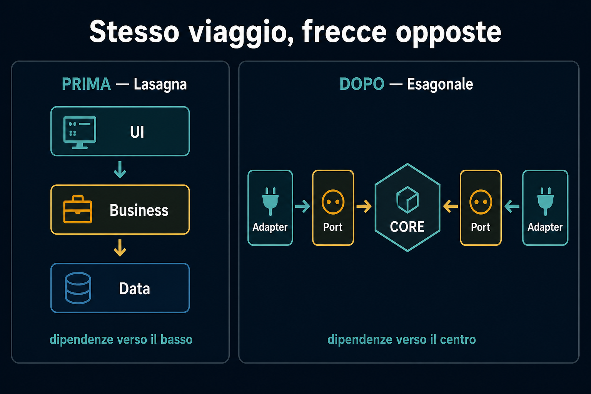

# 6. Sintesi

← [Perché usarla](5.perche-usarla.md) · [Indice](README.md)

---

## L'idea in una frase

Proteggi il **core** dal mondo esterno con **contratti** (ports) e **traduzioni** (adapters).

Le dipendenze puntano **sempre verso l'interno**.

Stesso viaggio della request. **Frecce opposte** nel grafo delle dipendenze.

## Mappa mentale

| Pezzo | Ruolo |
|---|---|
| **Core** | Logica, regole, *special sauce* |
| **Port** | Contratto sul bordo |
| **Driving adapter** | UI, API, messaggi — *chiama* il core |
| **Driven adapter** | DB, file, servizi — *chiamato* dal core |
| **Regola** | Dipendenze inward |
| **Test** | Un port, due adapter |

## Quando ha senso

- Il dominio **conta** e vuoi proteggerlo
- Devi **testare** senza DB, rete, framework
- Le tecnologie esterne **possono cambiare** (o già cambiano nei test)
- Vuoi **ritardare** la scelta del datastore / del delivery

Non è un dogma. È un modo semplice di isolare ciò che è vostro da ciò che non controllate.

## Inizia dal core.

Il core è il modello dei [percorsi 2](../2.DDD-strategico/README.md) e [3](../3.DDD-tattico/README.md): confini e regole. Il resto si innesta.

---

## Fonti

- [Hexagonal Architecture (All You Need to Know)](https://www.youtube.com/watch?v=k_GkYMd8Ouc) — Gui Ferreira
- Alistair Cockburn, *Hexagonal Architecture* (2005), anche nota come Ports & Adapters

## Percorso completo

1. [Origine](1.origine.md)
2. [Dentro e fuori](2.dentro-e-fuori.md)
3. [Ports e Adapters](3.ports-e-adapters.md)
4. [Perché un esagono](4.perche-un-esagono.md)
5. [Perché usarla](5.perche-usarla.md)
6. **Sintesi** (sei qui)

← [Torna all'indice](README.md)
