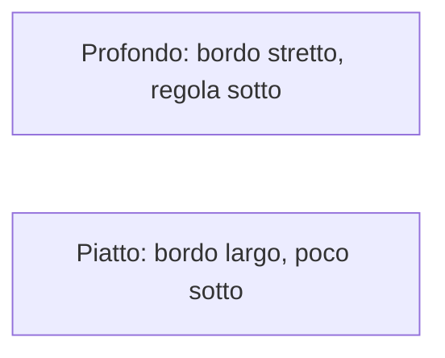

# 4. Profondi, non tanti

*Il core è profondo. I DTO no.*

← [Funziona non basta](3.codice-che-funziona-non-basta.md) · [Indice](README.md) · [Una decisione, un posto →](5.information-hiding.md)

---

L'esagono del percorso 4 è già questa idea: tanta *special sauce* dietro un contratto corto. Un modulo (classe, aggregate, servizio, adapter) ha due facce.

- **Bordo** — ciò che devi sapere per usarlo. Cosa fa, non come.
- **Dentro** — come mantiene le promesse.

Il bordo ha una parte che il compilatore vede (firme) e una che no (“prima conferma, poi incassa”; “questa operazione è idempotente”). Se ti serve saperlo, **è bordo**. I commenti e il linguaggio ubiquo lo rendono visibile. Senza, hai unknown unknowns.

Un'astrazione toglie dettagli *che non contano*. Due errori speculari: lasciare rumore (carico), togliere ciò che conta (falsa semplicità). Il dominio nasconde *come* persisti un ordine. Non può nascondere *quando* l'ordine è pagabile: quello chi lo usa deve saperlo.

**Profondo** = tanta funzione, poca superficie. Un aggregate `Ordine` con `conferma()` / `annulla()` è profondo se sotto ci stanno invarianti, stati, eventi. Un `OrdineService` da quaranta metodi che spostano campi è piatto: l'interfaccia *è* l'implementazione.

**Piatto** non è sempre un crimine. Un DTO a volte serve. Non combatte il fango. Un wrapper di una riga (`setFlag(x)` che fa `this.flag = x`) aggiunge un nome da imparare e zero nascondiglio.

La moda “tante classi piccole” produce **classitis**: ogni pezzo è semplice, il sistema è un labirinto di bordi. Stesso effetto della lasagna a tre layer: la complessità sale in cima, nelle orchestrazioni.

Il caso comune deve essere il più semplice. Se il 95% delle letture vuole una transazione e un timeout ragionevole, quello è il default. L'eccezione sta in un angolo che la maggioranza non vede — come un adapter opzionale, non come il modo *unico* di parlare col core.

Domanda da farsi su ogni tipo che aggiungi: **è profondo, o è un altro posto dove spargere la regola?**

---

← [3. Funziona non basta](3.codice-che-funziona-non-basta.md) · [Indice](README.md) · **Avanti:** [5. Una decisione, un posto →](5.information-hiding.md)
