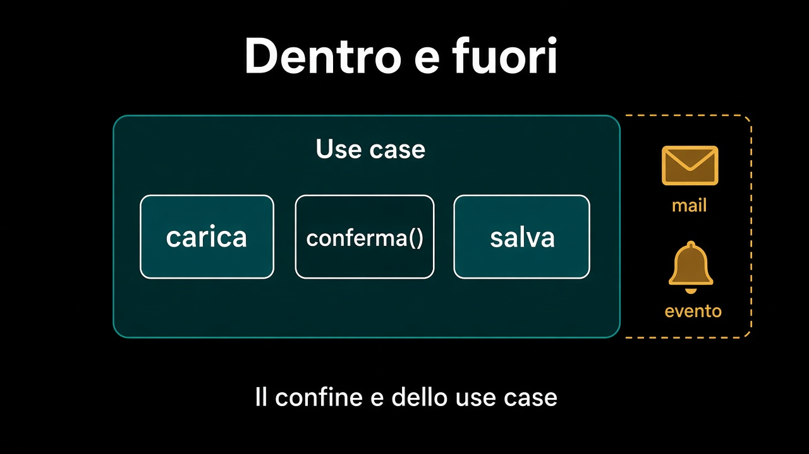

# 4. Chi apre la transazione

*Il confine è dello use case, non del modello*

← [Il mapping sta nell'adapter](3.mapping-nell-adapter.md) · [Indice](README.md) · [Due utenti, stesso ordine →](5.due-utenti-stesso-ordine.md)

---

## Il dominio non sa cosa sia una transazione

`ordine.conferma()` non apre niente e non conferma niente al database: cambia lo stato di un oggetto in memoria. Se il dominio sapesse di transazioni saprebbe di connessioni, e il [percorso 4](../4.Hexagonal-architecture/3.ports-e-adapters.md) ha già detto dove vive quel sapere.

Il posto è lo [use case](../3.DDD-tattico/5.use-case-e-dominio.md), che coordinava già: carica, chiama, salva. Decide **il confine** — da qui a qui è un'unica cosa — ma non apre la connessione con le sue mani: anche la transazione è tecnologia, e sta dietro un bordo o dentro un decoratore.

```text
// ConfermaOrdine — coordina, non decide
inTransazione(() -> {
  Ordine ordine = ordini.diId(id);   // carica
  ordine.conferma();                 // decide, in memoria
  ordini.salva(ordine);              // dichiara lo stato nuovo
});
// qui fuori: avvisa, pubblica il fatto, spedisci
```



## Un aggregate per transazione

La regola pratica è una riga: **una transazione tocca un aggregate**. Non è un vincolo tecnico, è la conseguenza di come l'aggregate è stato scelto — il [confine di ciò che cambia insieme](../3.DDD-tattico/4.aggregate.md).

Se una transazione ne tocca due, stai dicendo che quei due devono essere coerenti nello stesso istante. Allora una delle due cose è vera: il confine era sbagliato e vanno uniti, oppure stai tenendo fermo mezzo sistema per una regola che non lo chiedeva. E quando servono davvero due? Si fanno due transazioni, e in mezzo ci sta un fatto: l'ordine è confermato ora, il magazzino riserva un attimo dopo. È il seguito di questo percorso, e non si risolve allargando il `BEGIN`.

## Dentro e fuori

`ordini.salva(ordine)` dice «questo è lo stato nuovo». Il momento in cui diventa vero per tutti è il commit — e con un ORM può non essere partita nessuna scrittura prima di allora. Quindi dopo `salva` non c'è niente di definitivo, e conviene sapere cosa si è messo in mezzo.

| Dentro la transazione | Fuori |
|---|---|
| carica l'ordine | manda la mail |
| `conferma()` | chiama il corriere |
| `salva` | pubblica il fatto |

La colonna di destra è irreversibile: se il commit fallisce, la mail è partita comunque e l'ordine non è confermato. La colonna di sinistra si annulla da sola, ed è tutto il motivo per cui esiste un confine.

## Cosa resta fuori

Due utenti che confermano lo stesso ordine nello stesso momento: è il capitolo 5, e per ora basta sapere che il commit può fallire per un motivo che non è un bug.

Non è il capitolo sulle transazioni distribuite. Due database e un solo `BEGIN` è la scorciatoia che sembra salvare la coerenza e la sposta soltanto: il modo di tenere insieme due confini è un fatto che viaggia, non una transazione che si allarga.

Il confine ora c'è. Il capitolo dopo lo mette sotto pressione: due persone, lo stesso ordine, lo stesso istante.

---

← [3. Il mapping sta nell'adapter](3.mapping-nell-adapter.md) · [Indice](README.md) · **Avanti:** [5. Due utenti, stesso ordine →](5.due-utenti-stesso-ordine.md)
