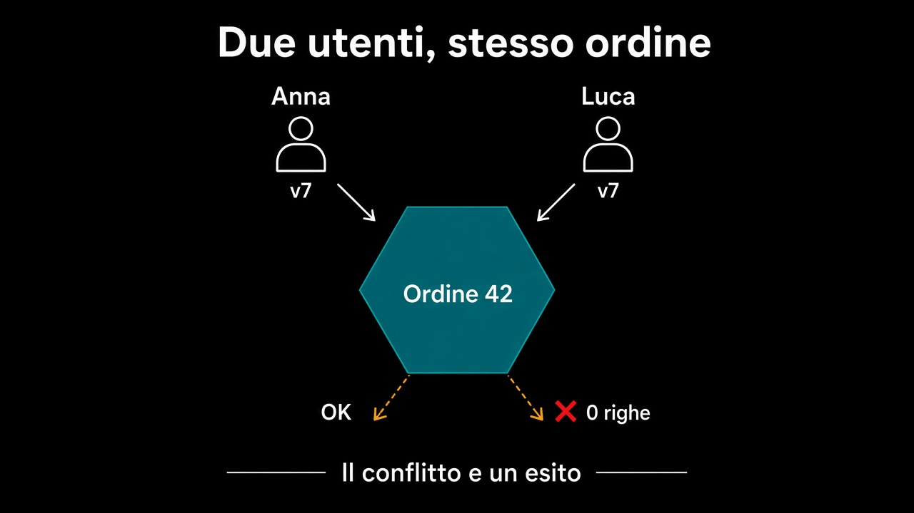

# 5. Due utenti, stesso ordine

*Il conflitto è un esito, non un errore tecnico*

← [Chi apre la transazione](4.chi-apre-la-transazione.md) · [Indice](README.md) · [Quando basta l'entità del framework →](6.quando-basta-il-framework.md)

---

## Lo stesso ordine, due letture

Anna e Luca aprono l'ordine 42 nello stesso minuto. Anna aggiunge una riga e salva. Luca, che ha letto un istante prima, conferma e salva: il suo `Ordine` non sa che esiste la riga nuova.

Nessuno dei due ha sbagliato, e il dominio non può accorgersene. Ognuno ha in mano un oggetto valido, montato da una fotografia valida: il problema non è nello stato, è nel **momento** in cui quella fotografia è stata scattata. Senza difese vince l'ultima scrittura, e vince in silenzio: la riga di Anna scompare, oppure l'ordine risulta confermato con un totale vecchio.



## Una colonna che dice no

Il **lock ottimistico** è una colonna `versione`. Chi legge si porta dietro il numero; chi scrive chiede di aggiornare solo se quel numero è ancora quello.

```text
UPDATE ordini SET ..., versione = 8 WHERE id = 42 AND versione = 7;
// zero righe aggiornate → qualcuno è passato prima
```

Zero righe non è un guasto: è un'informazione. Si chiama ottimistico perché non blocca nessuno — scommette che il conflitto sia raro e lo scopre alla fine. L'alternativa che blocca in lettura costa attese e code, e serve davvero solo dove la contesa è la norma.

La versione è dell'**aggregate**, non della riga. Anna ha toccato `righe_ordine` e Luca `ordini`: tabelle diverse, stesso invariante. Un numero sulla root protegge l'ordine intero, coerentemente con il [confine](../3.DDD-tattico/4.aggregate.md) che il capitolo 4 usa per la transazione. Se quel numero deve comparire nel modello, che resti un valore opaco: non è una regola, è il modo in cui l'adapter riconosce di essere in ritardo.

## Il conflitto ha un nome

Chi decide cosa fare non è l'adapter: è lo use case, come per ogni altra risposta che arriva da fuori. E le risposte possibili sono decisioni di business, non tecniche.

| Risposta | Quando |
|---|---|
| Riprova da sola: ricarica, riapplica, salva | l'operazione è ripetibile senza cambiare significato |
| Chiedi alla persona, mostrando cos'è cambiato | la scelta era informata, e ora l'informazione è vecchia |
| Rifiuta | ripetere non è sicuro |

Quello che non va fatto è trasformarlo in un errore 500 con lo stack del driver. «Qualcuno ha modificato questo ordine mentre lo guardavi» è una frase del dominio quanto «un ordine confermato non si modifica»: dice che due intenzioni si sono incrociate.

## Cosa resta fuori

Il livello di isolamento del database e le anomalie che porta con sé: scelta dell'adapter, e non cambia la forma del modello.

E quando chi riprova non è una persona ma un altro sistema, la domanda diventa un'altra — quante volte lo stesso messaggio può arrivare senza fare danni. È un discorso che comincia dove finisce la transazione.

Fin qui il doppio modello si è pagato sempre. Il capitolo che chiude il percorso dice dove non conviene pagarlo.

---

← [4. Chi apre la transazione](4.chi-apre-la-transazione.md) · [Indice](README.md) · **Avanti:** [6. Quando basta l'entità del framework →](6.quando-basta-il-framework.md)
