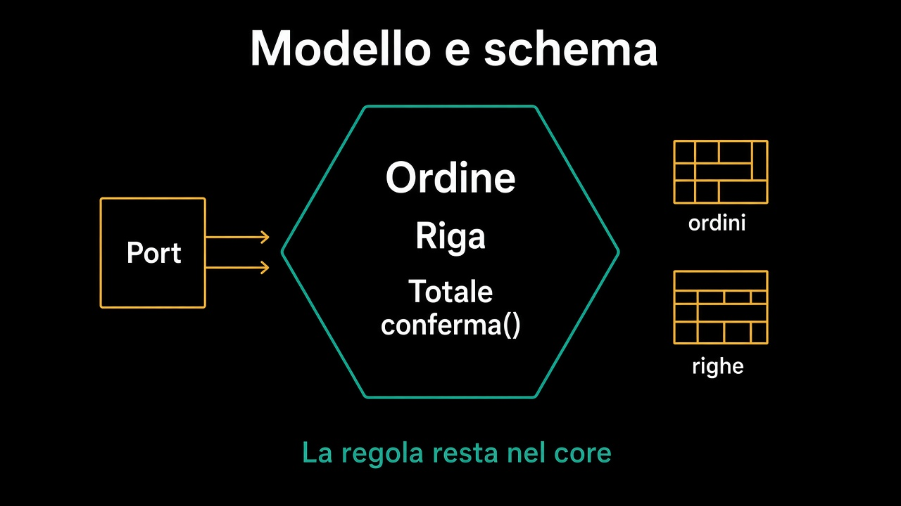

# Persistenza — il modello e lo schema

Dove si mette lo stato, quando la regola sta nel dominio.

Il [percorso 3](../3.DDD-tattico/README.md) ha chiuso l'ordine dietro operazioni di dominio e ha lasciato fuori tabelle, transazioni e lock: arrivano qui. Il [percorso 4](../4.Hexagonal-architecture/README.md) ha già dato i nomi: il contratto sul bordo è un **port**, la tecnologia sta in un **adapter**.

## Percorso

Leggi i capitoli in ordine. Ogni pagina è collegata alla precedente e alla successiva.

| # | Capitolo | Cosa imparerai |
|---|---|---|
| 1 | [Un aggregate non è una tabella](1.aggregate-non-e-tabella.md) | La forma dello stato non è la forma della regola |
| 2 | [Il repository è un port](2.repository-e-un-port.md) | `Ordini` è un contratto del core, non un DAO |
| 3 | [Il mapping sta nell'adapter](3.mapping-nell-adapter.md) | Come si ricostruisce un aggregate senza setter pubblici |
| 4 | [Chi apre la transazione](4.chi-apre-la-transazione.md) | Il confine transazionale è dello use case, non del modello |
| 5 | [Due utenti, stesso ordine](5.due-utenti-stesso-ordine.md) | Il conflitto è un esito che il dominio sa nominare |
| 6 | [Quando basta l'entità del framework](6.quando-basta-il-framework.md) | Il doppio modello si paga dove c'è complessità |

## L'idea in una frase

Lo schema conserva lo **stato**; la **regola** resta nel dominio. L'aggregate si sceglie per invarianti, la tabella per come si legge e si scrive: se coincidono è una comodità, non un principio.

---

**Inizia da qui →** [1. Un aggregate non è una tabella](1.aggregate-non-e-tabella.md)
