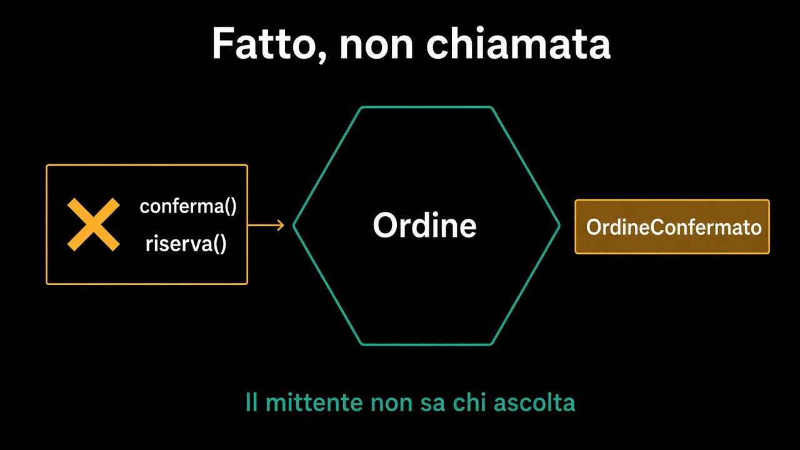

# 1. Un fatto, non una chiamata

*Il mittente non sa chi ascolta*

← [Indice](README.md) · [Evento di dominio ed evento di integrazione →](2.dominio-e-integrazione.md)

---

## Cosa è successo

`ordine.conferma()` ha tenuto la frase: un confermato non si modifica. Quello che resta da dire è **che è successo**. Non è una richiesta. Non è un consiglio. È un fatto, al passato: `OrdineConfermato`.

La differenza si vede in una riga.

```text
// così no: Vendite sa di Pallet, e il magazzino deve rispondere ora
ordine.conferma();
magazzino.riserva(idOrdine);

// così sì: Vendite dichiara un fatto
ordine.conferma();
// OrdineConfermato — chi ascolta, ascolta
```

La prima versione rompe il [confine](../3.DDD-tattico/4.aggregate.md) che il percorso 3 ha chiuso: l'ordine importa il magazzino per «essere DDD». La seconda tiene il fatto in Vendite. Il magazzino che riserva scorta sta oltre, come la context map aveva già detto.



## Chi decide il nome

Il nome è di **Vendite**. `OrdineConfermato`, non `RiservaRichiesta` e non `SpedizioneDaPreparare`. Quelle sono reazioni, e le battezza chi reagisce. Se il mittente dà il nome dal punto di vista di chi ascolta, ha già deciso chi deve ascoltare — e il prossimo ascoltatore obbliga a cambiare il primo.

Un fatto ha un soggetto, un momento, un identità. Non ha un destinatario.

## Cosa resta fuori

Il payload, la versione, il contratto verso fuori: capitolo 2. Come si pubblica senza mentire se il commit fallisce: capitolo 3.

E non è il capitolo sul bus. Kafka, coda, tabella: sono adapter. Il fatto esiste anche se stasera lo scrivi in una riga di log.

Se il fatto è di Vendite, però, non tutto ciò che Vendite sa deve uscire. Il prossimo capitolo taglia in due: cosa vive dentro, cosa attraversa il bordo.

---

← [Indice](README.md) · **Avanti:** [2. Evento di dominio ed evento di integrazione →](2.dominio-e-integrazione.md)
