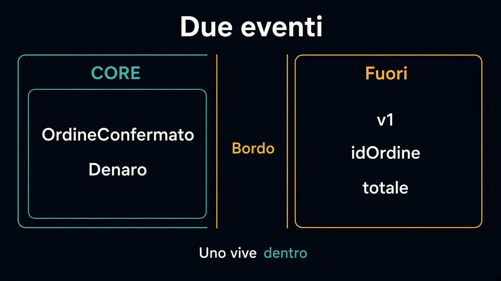

# 2. Evento di dominio ed evento di integrazione

*Uno vive dentro, l'altro è un contratto*

← [Un fatto, non una chiamata](1.un-fatto-non-una-chiamata.md) · [Indice](README.md) · [Salvare e pubblicare →](3.salvare-e-pubblicare.md)

---

## Due pubblici

Dentro Vendite, l'evento può essere ricco: `Denaro`, `Quantita`, lo stato da cui si è partiti. Lo capiscono solo chi parla questa lingua. Fuori, lo stesso fatto diventa un **contratto**: pochi campi, nomi stabili, niente tipi del modello.

```text
// dentro: ricco, nella lingua di Vendite
OrdineConfermato { id, righe, totale, confermatoIl }

// fuori: povero, versionato, senza Denaro
vendite.ordine-confermato.v1 { idOrdine, totale, valuta, quando }
```

Il secondo non esporta `Ordine`. Esporta quello che un altro contesto deve sapere per fare il **suo** lavoro — e nient'altro. [Tradurre al bordo](../2.DDD-strategico/5.tradurre-al-bordo.md) vale per i fatti come per le chiamate.



## Perché due, e non uno solo

Se pubblichi il modello, ogni cambio interno diventa un cambio pubblico. Aggiungi uno sconto sulla riga, e il magazzino smette di capire il messaggio. Se invece il contratto è povero, il modello può cambiare dietro: il fatto «è stato confermato» resta vero.

La versione sta sul contratto, non sul tipo interno. `v1` è un impegno. `v2` è un altro impegno. Non si «aggiunge un campo e si spera».

## Cosa resta fuori

Come si fa ad avere il fatto e lo stato nello stesso momento vero: capitolo 3. Cosa fa il magazzino se la scorta non c'è: capitolo 4.

E non è l'event sourcing. Un evento di dominio può esistere senza diventare la fonte dello stato. Quella è un'altra decisione, e sta fuori da questo percorso.

Il contratto adesso c'è. Resta il problema del [capitolo 4 della persistenza](../7.Persistenza/4.chi-apre-la-transazione.md): salvare e pubblicare non sono la stessa transazione.

---

← [1. Un fatto, non una chiamata](1.un-fatto-non-una-chiamata.md) · [Indice](README.md) · **Avanti:** [3. Salvare e pubblicare →](3.salvare-e-pubblicare.md)
