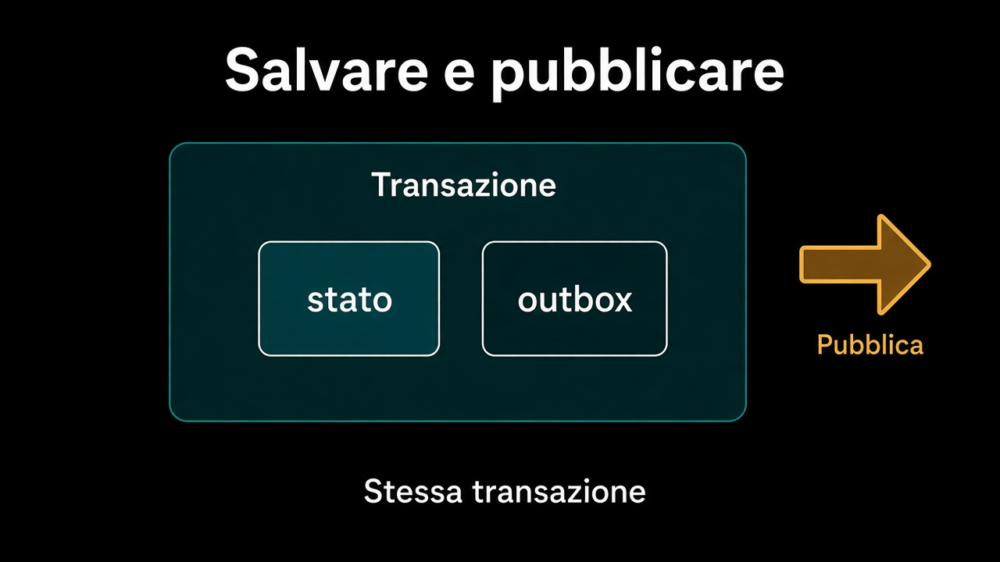

# 3. Salvare e pubblicare

*Due sistemi, nessuna transazione in comune*

← [Evento di dominio ed evento di integrazione](2.dominio-e-integrazione.md) · [Indice](README.md) · [Coerenza differita →](4.coerenza-differita.md)

---

## Il buco tra i due sì

Lo [use case](../7.Persistenza/4.chi-apre-la-transazione.md) salva l'ordine e poi pubblica. Due sì, due posti. Se il secondo fallisce, l'ordine è confermato e nessuno lo sa. Se inverti e fallisce il primo, il magazzino riserva un ordine che non esiste.

Non si risolve allargando il `BEGIN` fino al bus. Il bus non entra nella transazione del tuo database — e se lo fa, hai appena accoppiato due cose che dovevano restare sostituibili.



## L'outbox

La mossa noiosa e giusta: nella **stessa** transazione dello stato, scrivi anche una riga «da pubblicare». Poi un processo a parte legge quella riga e la manda. Se il commit passa, il fatto c'è. Se fallisce, non c'è né stato nuovo né riga. Il buco si chiude.

```text
inTransazione(() -> {
  ordine.conferma();
  ordini.salva(ordine);
  outbox.metti(vendite.ordine-confermato.v1, ...);
});
// dopo, altrove: leggi l'outbox, pubblica, segna inviato
```

`outbox` è un port, come `Ordini`. La tabella, la coda, il worker: adapter. Il core continua a non sapere di Kafka.

## Cosa resta fuori

Cosa succede *dopo* che il fatto è partito e il magazzino non può riservare: capitolo 4. Lo stesso messaggio che arriva due volte: capitolo 5.

E non è il capitolo sul two-phase commit. Due database e un coordinatore sembrano salvare la coerenza: la spostano, e aggiungono un terzo sistema da far sopravvivere.

Il fatto adesso parte. Parte in ritardo rispetto alla conferma — e quel ritardo ha un nome di business, non di rete.

---

← [2. Evento di dominio ed evento di integrazione](2.dominio-e-integrazione.md) · [Indice](README.md) · **Avanti:** [4. Coerenza differita →](4.coerenza-differita.md)
