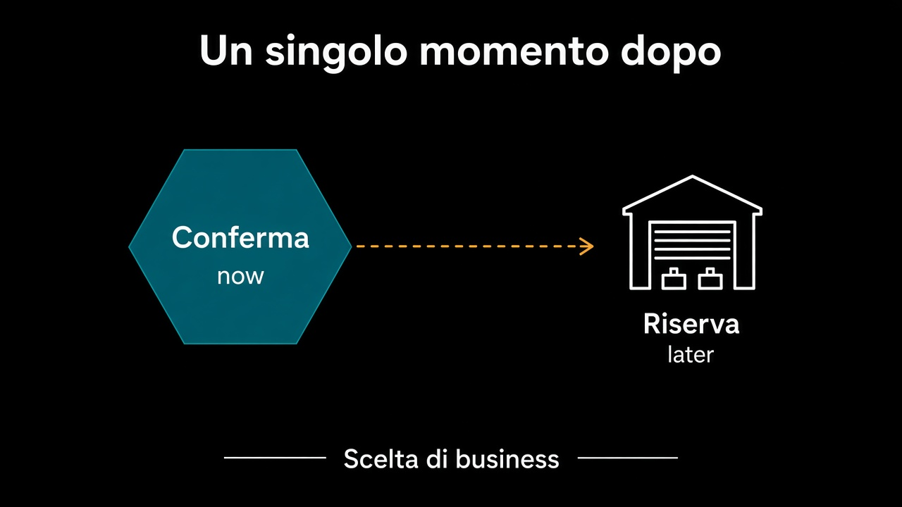

# 4. Coerenza differita

*L'attimo dopo è una scelta di business*

← [Salvare e pubblicare](3.salvare-e-pubblicare.md) · [Indice](README.md) · [Lo stesso messaggio due volte →](5.stesso-messaggio-due-volte.md)

---

## Non è un incidente

L'ordine è confermato. Il magazzino riserva un attimo dopo. Tra i due istanti lo stock può non esserci. Non è un bug dell'outbox: è la conseguenza di [due transazioni e un fatto](../7.Persistenza/4.chi-apre-la-transazione.md).

La domanda non è «come lo rendo immediato». È: **cosa dice il business quando succede?**

| Il business dice | Allora |
|---|---|
| «si vende, poi si trova una scorta» | backorder, attesa, un altro fatto |
| «senza pezzo non si conferma» | la riserva sta *prima*, e il confine era un altro |
| «si conferma, e se manca si annulla» | Vendite ascolta a sua volta: `ScortaMancante` |

Tre frasi diverse. Tre modelli. La tecnica le serve, non le sceglie. La coerenza immediata — conferma e riserva nello stesso `BEGIN` — è la prima riga della tabella letta al contrario: stai dicendo che le due cose devono essere vere nello stesso istante. Allora forse erano lo stesso aggregate, e il percorso 3 andrebbe riaperto.

## Chi parla al cliente

Tra i due istanti il cliente vede un ordine confermato. Se la scorta manca, qualcuno deve dirlo nella lingua di Vendite — non con un errore del magazzino in faccia alla UI. Si traduce al bordo, di nuovo: `ScortaMancante` diventa un annullamento, o una riga «in attesa», non un `Pallet` nel controller.

## Cosa resta fuori

Il messaggio che arriva due volte e riserva due volte: capitolo 5. Il pagamento, che non è un attimo dopo ma un processo: capitolo 6.

E non è il capitolo sulle saghe come prodotto. Prima la frase. Poi, se serve, lo strumento.

Il fatto adesso viaggia. I viaggi, però, non sono una volta sola.

---

← [3. Salvare e pubblicare](3.salvare-e-pubblicare.md) · [Indice](README.md) · **Avanti:** [5. Lo stesso messaggio due volte →](5.stesso-messaggio-due-volte.md)
