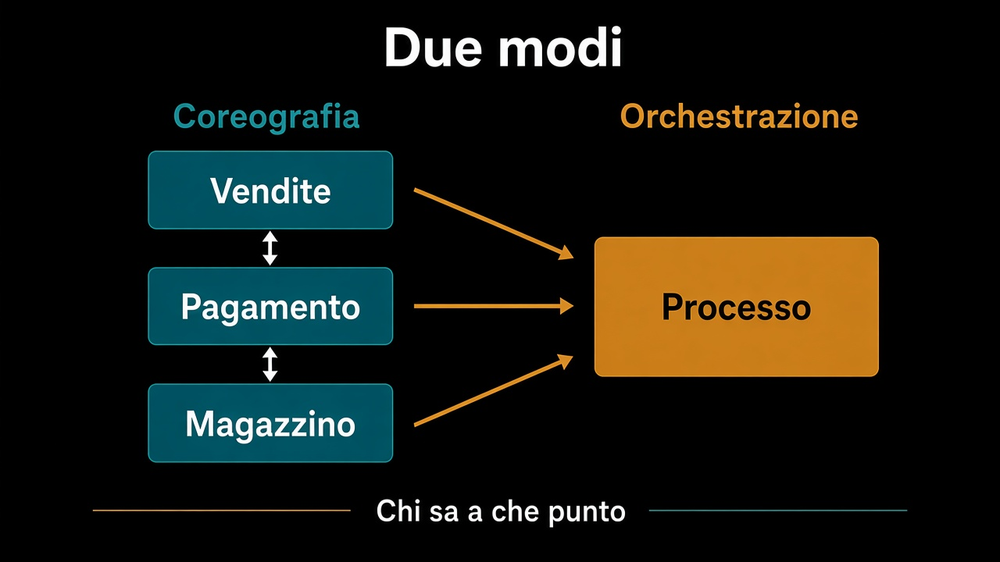

# 6. Coreografia od orchestrazione

*Chi sa a che punto siamo*

← [Lo stesso messaggio due volte](5.stesso-messaggio-due-volte.md) · [Indice](README.md)

---

## Il pagamento non è un attimo dopo

Incassare non è riservare scorta. Ha tentativi, un PSP, un esito che arriva tardi, un rimborso. [Pagamento](../2.DDD-strategico/4.context-map.md) era un satellite: Vendite chiede «incassa», non importa il protocollo. Quel «chiede» qui diventa un fatto, e poi un altro, e poi un altro ancora.

Due modi di tenerli insieme.

**Coreografia.** Ogni contesto ascolta e pubblica. Vendite conferma, Pagamento incassa, Magazzino spedisce quando sente `Pagato`. Nessuno ha la mappa intera. Funziona se le frasi sono poche e i fallimenti hanno già un nome.

**Orchestrazione.** Qualcuno sa a che punto è l'ordine: un **process manager** che ascolta, decide il prossimo comando, ricorda lo stato del processo. Non è il dominio di Vendite. È il copione *tra* i contesti.

## Quando serve il direttore

Quando il prossimo passo dipende da **due** esiti, o da un tempo, o da un «se fallisce fai quest'altra cosa» che non sta in nessun aggregate. «Se il PSP rifiuta, annulla l'ordine e sblocca la scorta» è un copione. Lasciarlo sparso in tre listener è il fango con i fatti al posto dei setter.

Il process manager parla in comandi e fatti, non in tabelle altrui. Non importa `Pallet`. Manda `AnnullaOrdine`, ascolta `OrdineAnnullato`.

## Cosa succede ora

I fatti attraversano i confini senza trascinarsi i modelli. Resta da verificare che quei confini tengano: che `conferma()` rifiuti da sola, che il port abbia due adapter, che lo use case si possa girare in memoria. È il [percorso sui test](../9.Test/README.md).

L'event sourcing — lo stato come somma di fatti — è un altro discorso. Qui i fatti *escono*. Non sono ancora il modo in cui l'ordine esiste.

---

## Percorso completo

1. [Un fatto, non una chiamata](1.un-fatto-non-una-chiamata.md)
2. [Evento di dominio ed evento di integrazione](2.dominio-e-integrazione.md)
3. [Salvare e pubblicare](3.salvare-e-pubblicare.md)
4. [Coerenza differita](4.coerenza-differita.md)
5. [Lo stesso messaggio due volte](5.stesso-messaggio-due-volte.md)
6. **Coreografia od orchestrazione** (sei qui)

← [Torna all'indice](README.md) · [Mappa dei percorsi](../README.md)
