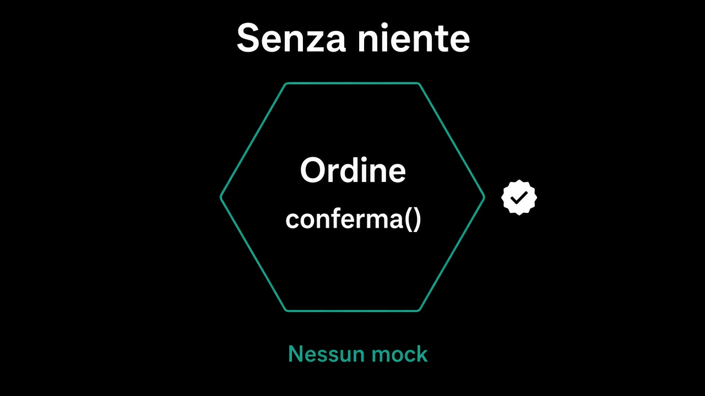

# 1. Il dominio si testa senza niente

*Nessun mock, nessun container*

← [Indice](README.md) · [Un port, due adapter, un test →](2.un-port-due-adapter.md)

---

## Una funzione con regole

`ordine.conferma()` sa se sei in bozza, se ci sono righe, se la frase tiene. Per verificarlo non serve un database. Non serve un framework. Non serve un doppio di `Ordini`. Serve un `Ordine` in memoria, e un'asserzione.

```text
ordine = Ordine.nuovo(...);
ordine.aggiungiRiga(id, Quantita(2), prezzo);
ordine.conferma();
ordine.aggiungiRiga(...);   // deve rifiutare
```

Se questo test ha bisogno di un mock, la regola non sta nell'ordine: sta nello use case, o in un servizio, o in un `if` sparso. Il [percorso 3](../3.DDD-tattico/1.dalla-frase-al-comportamento.md) l'aveva già detto. Qui si misura.



## Cosa entra, cosa no

Entra ciò che il dominio possiede: stati, value object, rifiuti. Non entra `OrdiniSql`. Non entra il bus. Non entra il tempo di rete. Se per montare l'ordine ti serve una sessione, il [mapping](../7.Persistenza/3.mapping-nell-adapter.md) è ancora nel core.

Il test del dominio è il più veloce che hai. Se è lento, stai testando altro e lo chiami dominio.

## Cosa resta fuori

Il port, e il fatto che lo stesso test debba girare su due adapter: capitolo 2. Lo use case: capitolo 3.

E non è il capitolo su *quale* libreria. Il nome del test, sì — ma al capitolo 4. Qui conta solo: la regola si vede da sola, o no.

Il core adesso ha un conto. Il conto del bordo è un altro: un port che non si finge non è un port.

---

← [Indice](README.md) · **Avanti:** [2. Un port, due adapter, un test →](2.un-port-due-adapter.md)
