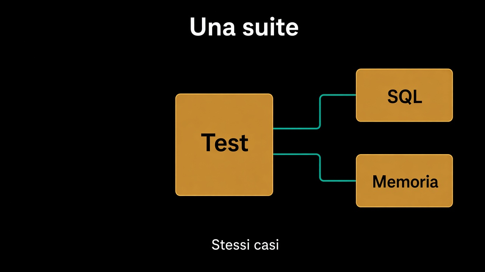

# 2. Un port, due adapter, un test

*Se il secondo non si scrive, il contratto mente*

← [Il dominio si testa senza niente](1.dominio-senza-niente.md) · [Indice](README.md) · [Lo use case con adapter in memoria →](3.use-case-in-memoria.md)

---

## La regola, in codice

Il [percorso esagonale](../4.Hexagonal-architecture/5.perche-usarla.md) la enunciava: per ogni port, produzione e test. Qui è una suite sola. Gli stessi casi, due adapter.

```text
per ciascun adapter in { OrdiniInMemoria, OrdiniSql } {
  ordini.salva(ordine);
  letto = ordini.diId(id);
  // stesso ordine, stessi invarianti
}
```

Non due batterie che divergono. Una. Se il caso «un confermato torna confermato» passa in memoria e fallisce su SQL, il bug è nella traduzione — e lo vedi. Se non riesci a scrivere `OrdiniInMemoria` in poche righe, `Ordini` non è il [port del capitolo 2](../7.Persistenza/2.repository-e-un-port.md): è un DAO.



## Cosa deve essere uguale

I metodi. I rifiuti. L'ordine che torna intero. Non le eccezioni del driver, non i timeout, non il SQLSTATE: quelli sono dell'adapter di produzione, e hanno test loro, corti, pochi.

Il fake non è «più permissivo». Se `diId` in memoria torna `null` e in SQL tira, lo use case ha due vite. L'esito ha un nome, su entrambi.

## Cosa resta fuori

Come si gira lo use case intero contro il fake: capitolo 3. I sintomi di un test che sta chiedendo un altro design: capitolo 5.

E non è il capitolo sul container di test. Un database vero per la suite condivisa va bene — è il secondo adapter. Un container per testare `conferma()` no.

Il port adesso ha due facce. Lo use case le usa tutte e due senza saperlo.

---

← [1. Il dominio si testa senza niente](1.dominio-senza-niente.md) · [Indice](README.md) · **Avanti:** [3. Lo use case con adapter in memoria →](3.use-case-in-memoria.md)
