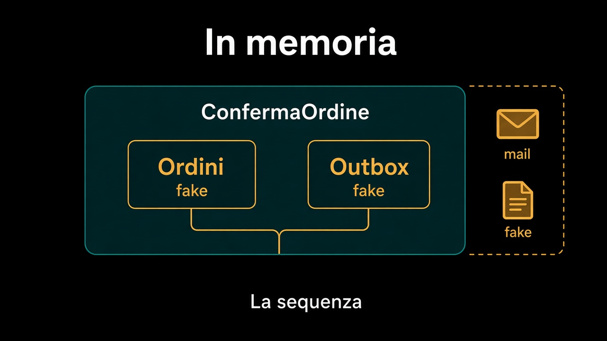

# 3. Lo use case con adapter in memoria

*La sequenza, non il database*

← [Un port, due adapter, un test](2.un-port-due-adapter.md) · [Indice](README.md) · [Il test parla la lingua del business →](4.lingua-del-business.md)

---

## Cosa verifica

Lo [use case](../3.DDD-tattico/5.use-case-e-dominio.md) carica, chiama, salva, avvisa. Il test in memoria verifica **quella sequenza**: che `conferma()` venga chiamata, che l'ordine torni salvato, che il fatto finisca nell'outbox. Non verifica che MySQL abbia scritto due tabelle.

```text
ordini = OrdiniInMemoria();
outbox = OutboxInMemoria();
ConfermaOrdine(ordini, outbox).esegui(id);
// l'ordine in memoria è confermato
// l'outbox ha vendite.ordine-confermato.v1
```

`OrdiniInMemoria` è l'adapter che il percorso 7 chiedeva per misurare il port. Qui misura lo use case. Se per montarlo ti servono cinque mock, lo use case sa troppe facce — o il port è ancora un `Repository<T>`.



## Cosa non entra

La mail vera. Il bus vero. Il catalogo vero. Se lo use case «non confermare se dismesso» deve chiedere al catalogo, quel «chiedere» è un port: `Catalogo.ePubblicabile(id)`. In memoria torna sì o no. Non si mocka una classe interna di Vendite.

Il test dello use case è più lento del test di `conferma()`, e va bene: fa più strada. Non deve fare la strada del database.

## Cosa resta fuori

Come si chiama questo test, e perché il nome è la frase: capitolo 4. Cosa fare quando il setup è già lungo: capitolo 5.

Due adapter sullo stesso port, uno use case sottile, un dominio che si testa da solo. Se i nomi dei test parlano di `setStato`, qualcosa è tornato indietro.

---

← [2. Un port, due adapter, un test](2.un-port-due-adapter.md) · [Indice](README.md) · **Avanti:** [4. Il test parla la lingua del business →](4.lingua-del-business.md)
